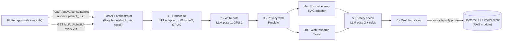

# 🧭 FastAPI Orchestrator (Module 5) — Final Build Plan

> **Supersedes** `FastAPI_Orchestrator_Plan.md`, the first plan, which has been deleted; this document replaces it. The research docs this plan cites (`final-project-stack.md`, `kaggle_stack.md`, `centralbrain.md`, …) live on the `docs` branch.
> Written 25 Sep 2026 after reviewing every markdown file in the repo (including docs deleted from git history).

| | |
|---|---|
| **Project** | AI Clinical Scribe: multilingual (Kannada + English) ambient listening with a clinical safety net |
| **This module** | Module 5, the FastAPI Orchestrator (owner: Shreyas, built with Claude) |
| **Other modules** | 1: Flutter frontend (web + mobile) · 2: STT (Shriya) · 3: RAG database (Sanjana) · 4: LLM Central Brain + Privacy (Shreyas, next) |
| **Hosting** | Kaggle notebook (GPU T4 ×2) + ngrok free static domain. **$0.** |
| **Team workflow** | Every module is built independently and merged at the end of the hackathon |
| **Verification** | Every orchestrator Python block below was executed while writing this plan, and was machine-checked against the tested prototype. The 38-test suite passed on Python 3.12.10 and 3.14.6 with the pinned versions in Appendix A. Blocks that can only run on Kaggle, and code for teammates' modules or the Flutter app, are labelled **not run here** / **untested sketch**. |

---

## 0. Read this first

### 0.1 What the orchestrator does, in plain language

The orchestrator is the **traffic controller** of the whole product. The Flutter app sends it one thing: the recording of a consultation plus the ID of the patient. It gives back one thing: a **draft clinical note with safety alerts**, which the doctor reads, edits if needed, and approves.

In between, the orchestrator runs the recording through six steps, in a fixed order:

1. **Transcribe.** Turn the recording into text, split by speaker.
2. **Write the note.** Translate the Kannada/English conversation into a structured English note.
3. **Remove personal details.** Names, phone numbers and ID numbers are taken out.
4. **Look up the patient's history and the latest drug information**, at the same time.
5. **Check for danger.** Allergies, drug interactions, contradictions, overdue tests.
6. **Hand the draft to the doctor.** Nothing is saved until the doctor approves it.

The orchestrator does no AI work itself. It calls the other modules in the right order, keeps the GPU from being overloaded, protects patient privacy, and makes sure that when a piece breaks, **the doctor sees that it broke**. A broken check must never look like "all clear".

### 0.2 The ten biggest changes from the first plan

| # | Change | Why, in one line |
|---|---|---|
| 1 | **Background jobs + polling.** The upload returns at once with a `job_id`, and the app asks for progress every 2 s. | A 10–15 min recording takes minutes to process, and tunnels, phones and browsers drop requests that hang that long. |
| 2 | **Every model call runs in a worker thread.** | The real models block. Called directly, one upload would freeze the whole server, including the progress checks. |
| 3 | **One GPU slot and a visible queue.** | Two jobs at once on a 16 GB GPU run out of memory and crash. |
| 4 | **Typed data plus one adapter per teammate module.** | Modules are merged at the end, so each mismatch must stay inside one small file instead of spreading through the pipeline. |
| 5 | **The doctor approves before anything is saved.** | An AI mistake saved as a "recent doctor note" would override correct clinic records at the next visit. |
| 6 | **A privacy wall right after the note is written.** | Web search, history lookup, the second AI pass and storage only ever see scrubbed text. |
| 7 | **Tavily web research as its own step, with a strict query rule.** | Only generic drug names from our own list can ever leave the server. |
| 8 | **A deterministic safety check alongside the AI.** | The key demo alert (Amoxicillin for a Penicillin-allergic patient) must never depend on the LLM happening to notice. |
| 9 | **Audio stays in RAM and is deleted right after transcription.** | Honours the "raw audio never touches the disk" promise in our pitch. |
| 10 | **Accepts the files Flutter actually sends.** WebM (web), m4a (mobile), and `application/octet-stream`. | The first plan would have rejected real Flutter uploads. |

### 0.3 How to use this document

- **Humans:** read §0–§3 for the why, then build with §6 one step at a time. Every step ends with a **Done when** check.
- **An AI coding agent:** give it this file and the prompt below.

```text
You are implementing Module 5 (FastAPI orchestrator) of the AI Clinical Scribe, exactly as specified in
"shreyas research/FastAPI_Orchestrator_Final_Plan.md". Work in backend/. Follow Steps 0-12 of section 6
(everything that runs on a laptop) in order and run each step's "Done when" check before moving on. Use the code blocks verbatim; where the
plan describes a file instead of showing it, implement exactly what is described. Do not change
app/contracts.py, the API paths or the JSON shapes. Every service stays on its mock until the plan says
otherwise, and teammate code is only ever imported from app/services/real/. Never log transcript or note
text. When all tests pass, stop and report.
```

---

## 1. Review of the first plan

### 1.1 What it got right (kept)

- **Mocks first**, so the orchestrator can be built and tested before the other modules exist.
- **One service file per module**, which gives each module a clear boundary.
- A health endpoint, CORS for the frontend, UUID-based temp names, and cleanup in `finally`.
- A short, focused scope.

### 1.2 What had to change

| # | Angle | Problem in the first plan | Why it matters, in plain terms | Fix in this plan |
|---|---|---|---|---|
| 1 | Fit with the final stack | Built for a 30–60 s English **dictation**. `final-project-stack.md` (the team's "single source of truth") says **10–15 min ambient Kannada+English recording with speaker separation** (WhisperX + pyannote). | It was designed for a product the team has moved away from. | The transcript carries speakers, timestamps, the language, and whether word alignment ran. |
| 2 | Async correctness | Mocks are `async` with `asyncio.sleep`, but WhisperX, the LLM, Presidio and embeddings are **blocking** code. | Tests pass on mocks. After the merge, one upload freezes the whole server, including `/health` and progress polling. | Mocks sleep the blocking way, like the real code. The pipeline calls every service through `asyncio.to_thread`. A test proves `/health` answers while a job is running. |
| 3 | Long requests | One HTTP request waits for the whole pipeline. | Minutes of processing per request. Connections through tunnels, mobile data and browsers drop. (RunPod, the host named in `final-project-stack.md`, even cuts proxied requests off at 100 s.) | Background job: `202 Accepted` + `job_id`, then `GET /jobs/{id}` every 2 s. This also gives the app a live progress display. |
| 4 | GPU safety | No limit on parallel jobs, and no plan for model loading. `final-project-stack.md` makes the orchestrator responsible for VRAM. | Two uploads at once run out of GPU memory and crash, and loading a model per request is slow. | One GPU slot with a queue position; `429 BUSY` beyond 4 pending jobs. Models load once at startup. `GPU_POLICY=resident\|swap`. One uvicorn worker. |
| 5 | Loose data types | `transcribe → str`, `get_patient_context → str`, `generate → dict`, `save → bool`. | Speakers, sources and dates are lost, so the RAG design's **"recent doctor note beats older clinic data"** rule can't work, and alerts can't cite evidence. Errors surface at the very end. | Typed Pydantic models and service interfaces in `app/contracts.py` (§4). Allergies, medications and labs arrive as **structured facts with a source and date**, never dependent on similarity search. |
| 6 | Merge at the end | The pipeline would call teammates' functions directly, with guessed names and shapes. | Any mismatch (sync/async, file vs bytes, dict keys, device, language codes) breaks the core pipeline at the worst possible time, with no fallback. | **Adapter layer.** The pipeline never imports teammate code. Merge day = write one adapter file per module, test it alone with `scripts/probe_module.py`, then flip one config switch. Each service can be flipped back to its mock. |
| 7 | Clinical safety | The AI note is saved automatically. | Combined with the precedence rule above, an unreviewed AI mistake becomes "recent doctor note" truth that overrides correct clinic data next visit. It also undercuts our own "automation complacency" argument (`Competitive_Analysis_Moat.md`). | **Draft → doctor reviews/edits → Approve → scrubbed again → saved.** |
| 8 | Clinical safety | `ai_warnings: List[str]`. If the history lookup fails, the note silently has no warnings. | The doctor can't see *why* something was flagged, and "no warnings" reads as "safe". | `SafetyAlert` with category, severity, evidence (source, date, URL) and origin. A `checks` report on every note. A top alert when a cross-check was **not** performed. |
| 9 | Demo reliability | The Amoxicillin-vs-Penicillin moment depends entirely on the LLM. | One miss in front of the judges sinks the pitch. | A small deterministic rule check that runs on every draft: drug classes, Indian brand names, interaction pairs, the contradiction rule, and a lab-monitoring rule. Rule alerts win over duplicate AI alerts. |
| 10 | Privacy | Audio written to a disk `/temp`. No Presidio step anywhere. The mock `print`s note data. | Contradicts the "raw audio never touches disk" line of `Audio_Processing_Pipeline.md`. Starlette also writes every upload over 1 MB to disk by itself. Kaggle keeps printed output in saved notebook versions. | Audio stays in RAM (`/dev/shm` + raised `MultiPartParser.spool_max_size`, tested) and is deleted right after STT. A privacy wall that **fails closed**. A logger that cannot print patient text (tested). Jobs and drafts expire from memory. |
| 11 | Web research missing | No Tavily step, though "we search the web for the latest FDA warnings" is part of our moat. | If the AI writes its own search queries, a patient's name could be sent to an outside company. Tavily can also be slow, down, or out of its 1,000 free credits a month. | A research step with a **fixed query template built only from generic drug names in our vocabulary**, trusted-domain filtering, a timeout, a 24-hour cache, and pre-fetching of the demo drugs. If it fails, the job continues and says so. |
| 12 | Frontend fit | Accepts only `audio/mpeg` and `audio/wav`. | Flutter Web records **WebM/Opus**, Flutter mobile records **m4a/AAC**, and Dart's `MultipartFile.fromPath` sends **`application/octet-stream`** unless told otherwise. Real uploads would be rejected. | Accept by MIME type *or* audio file extension. Size and empty-file checks. One error format for everything (§5.2). |
| 13 | Missing API | No patient list, profile, history, similar-case search, Q&A, deletion, or readiness check. | The app can't show a patient picker, and moat features from the docs (global similarity search, "refuses to diagnose", cascading deletion) have no endpoint. | P0/P1/P2 endpoints (§5.1). |
| 14 | Testing & operations | No tests, no smoke test, no warm-up, and `/health` always says "ok". | Problems would be found live, on stage. | 38-test pytest suite (~1 s), a PHI-in-logs test, a smoke-test script, a merge-day probe script, and a real `/ready`. |

The first plan's single endpoint `POST /api/process-consultation` becomes `POST /api/v1/consultations` (returns a job) plus `GET /api/v1/jobs/{job_id}` (progress and result).

### 1.3 Where the team's documents disagree

These are outside Module 5, but they change what the orchestrator must handle and what we can safely say on stage.

| Topic | One document says | Another says | What this plan does |
|---|---|---|---|
| Capture mode | `final-project-stack.md`: ambient, whole consultation, Kannada+English | `Competitive_Analysis_Moat.md`, `Health_Risk_Pitch_Strategy.md`, `Audio_Processing_Pipeline.md`: post-consultation English dictation, and ambient "fails miserably" | **Ambient only** (team decision). ⚠️ The pitch docs still argue *against* ambient and promise "sub-3-second processing". Update them before the pitch; quote the measured `timings_ms` instead. |
| Speech-to-text | WhisperX large-v3 + pyannote | NVIDIA Parakeet 0.6B (English only) | WhisperX, since Parakeet can't do Kannada. The orchestrator doesn't care which engine; the STT adapter hides it. |
| LLM | ~32B at 4-bit (`final-project-stack.md`) | OpenBioLLM-8B / 70B (`centralbrain.md`); Gemini / GPT-4o-mini / Llama-3-8B (`Multilingual_Ambient_Stack_Draft.md`) | A 32B 4-bit model (~18–20 GB) does **not** fit one 16 GB Kaggle T4. Recommendation for Module 4: ≤14B at 4-bit, on GPU 1. |
| GPU host | RunPod 24 GB (`final-project-stack.md`) | Kaggle, $0 (`kaggle_stack.md`) | **Kaggle only** (team decision). |
| Where Presidio runs | Before the LLM (`Health_Risk_Pitch_Strategy.md`) | After the LLM, on the English note (`final-project-stack.md`) | **After the LLM.** Presidio's English models can't read Kannada, so it must run on the translated note. This is acceptable because the LLM runs on our own GPU. Adjust the pitch line "scrub before the AI sees it". |
| Embeddings | `BAAI/bge-small-en-v1.5` (English-only) | Queries would be Kanglish transcripts | The history lookup runs **after** translation, using the English note as the query, so English-only embeddings work. |
| Web research | Tavily (`centralbrain.md`, confirmed by the team) | `final-project-stack.md` and the zero-trust pitch don't mention it | Kept, with the "generic drug names only" query rule (§6 Step 9), so zero-trust still holds. |
| Frontend | Flutter web + mobile (confirmed) | Next.js / React Native (older docs) | Flutter. |
| RAG source tag | `source: doctor_personal_notes` (`RAG_Database_Architecture.md`) | — | Our models call it `doctor_notes`. The RAG adapter maps between the two on merge day. |

### 1.4 Risks in other modules that the orchestrator must absorb

All of these were checked against library source code or documentation while writing this plan (see Sources).

| Risk | Fact | What the orchestrator does about it |
|---|---|---|
| Kannada word alignment | WhisperX has **no default alignment model for Kannada (`kn`)**. `load_align_model` raises `ValueError`. Hindi, Telugu and Malayalam have one; Kannada and Tamil don't. | The transcript has an `aligned` flag. The STT adapter must catch the error and assign speakers per segment (sketch in Step 16). |
| Code-switching | WhisperX detects the language **once, from the first 30 s**, and uses it for the whole file. | The upload accepts `language_hint=auto\|kn\|en`. Test a real Kanglish recording early; the hint may give better results than auto. |
| Diarization access | pyannote needs a Hugging Face token and accepted model terms. | `HF_TOKEN` is a Kaggle secret (Step 13). |
| GPU size | A 32B model at 4-bit doesn't fit one 16 GB T4. Kaggle T4×2 is two separate 16 GB GPUs. | Default `GPU_POLICY=resident`: STT and small models on GPU 0, the LLM (Ollama) pinned to GPU 1. `swap` exists for a single GPU. |
| Presidio defaults (tested) | Default settings turned "3 days" and "last week" into `<DATE_TIME>`, "Brufen" into `<LOCATION>` and "Lakshmi" into `<ORGANIZATION>`. `en_core_web_sm` missed "Ravi", "Lakshmi" and "Arjun" as names. Weak PAN patterns turned the word "prescribed" into `<IN_PAN>`. | The tested Presidio adapter (Step 15) uses a restricted entity list, `allow_list` (drug/symptom names), a **deny-list of the patient's own names**, `score_threshold=0.4`, and `en_core_web_lg`. |
| LLM output | A free-form LLM answer is not reliable JSON. | Ollama's `format` = our JSON schema, Pydantic validation, one retry (tested against a fake Ollama server). |
| Kannada token count | Kannada script usually costs far more tokens per word than English in common LLM tokenizers. | Module 4 should choose a model with a long context window (≥32k is a safe target) and measure a real 15-minute transcript. |
| ngrok free plan | 1 GB transfer and 20,000 HTTP requests a month. Browser traffic gets a warning page unless the `ngrok-skip-browser-warning` header is sent. One free static dev domain per account. | Small audio settings (Step 14), polling every 2 s, the header on every request, and CORS allowing it. The static domain keeps the URL the same after restarts. |
| Tavily free plan | 1,000 credits a month; a basic search costs 1 credit. | Basic depth only, at most 4 drugs per job, 24-hour cache, and pre-fetching of the demo drugs. |

---

## 2. Decisions locked for this build

| Decision | Plain-language reason |
|---|---|
| **Kaggle notebook is the only host** (T4 ×2, free), exposed through ngrok's free static domain | $0 budget. The static domain means the Flutter app's URL never changes when the notebook restarts. |
| **Ambient recording only**, Kannada + English, with speakers separated | Matches `final-project-stack.md`, the team's source of truth. |
| **Background job + polling** instead of one long request | Minutes of processing can't safely hang on one HTTP call, and polling gives the progress display for free. |
| **The doctor approves before saving** | Keeps AI mistakes out of the patient's long-term memory. `AUTO_APPROVE=true` exists for tests only. |
| **Pipeline order: transcribe → write note → scrub → (history ∥ web) → safety → draft** | Scrubbing right after the note is written means nothing downstream (web, database, second AI pass) sees identifiers. It also gives the English history lookup and Tavily the English drug names they need. |
| **Modules merged at the end, through adapters** | The team's chosen workflow. Adapters keep each merge problem inside one small file, and each module can be switched back to its mock. |
| **Tavily queries = generic drug name + fixed words, nothing else** | The only data that ever leaves the server is a word like "amoxicillin". |
| **A deterministic rule check runs alongside the AI review** | The demo's key alerts must be guaranteed. Rule alerts are auditable, which medical judges like. |
| **Fail closed on privacy, fail visible on safety** | If scrubbing fails, nothing is sent or saved. If a safety check can't run, the doctor is told so in red. |
| **Everything in memory, one process, one worker** | Simple and fast for a demo, and transcripts are never written anywhere. A restart forgets jobs, which is acceptable. |
| **Synthetic patients only**, in every environment | Kaggle and ngrok are third-party services. Real patient data must never touch the demo setup. |

---

## 3. Architecture

### 3.1 The big picture



### 3.2 The stages a job moves through

The `stage` value is what the app receives when polling. The label is what the app shows.

| # | `stage` | What happens | Label shown to the doctor |
|---|---|---|---|
| 0 | `queued` | Waiting for the one GPU slot | Waiting for the GPU |
| 1 | `transcribing` | STT → speaker-separated text. **The recording is deleted right after.** Optional progress 0–1. | Transcribing and separating speakers |
| 2 | `writing_note` | LLM pass 1 translates and structures the note. It sees the raw transcript, on our own GPU. | Translating and writing the clinical note |
| 3 | `scrubbing_pii` | Presidio removes names, phones, emails, Aadhaar and PAN numbers from every free-text field (the **privacy wall**) | Removing personal identifiers |
| 4 | `gathering_context` | History lookup **and** Tavily research, **in parallel**, both using the scrubbed English note | Checking patient history and latest drug information |
| 5 | `checking_safety` | LLM pass 2 (AI safety review) plus the deterministic rule check, merged and sorted by severity | Cross-checking allergies and interactions |
| 6 | `ready_for_review` | The draft waits for the doctor. **The app stops polling here.** | Draft ready for your review |
| — | `saved` / `discarded` / `failed` | After Approve / Discard / an error | Saved to patient history / Draft discarded / Processing failed |

### 3.3 What happens when something breaks

| If this fails… | …the job | Why |
|---|---|---|
| Upload checks (type, size, patient) | Rejected at once with an HTTP error; no job is created | Bad input |
| Transcription, or no speech found | `failed`: `STT_FAILED` / `NO_SPEECH` | Nothing to work with |
| Note writing (LLM pass 1) | `failed`: `NOTE_GENERATION_FAILED` | There is no note |
| Privacy scrub | `failed`: `PRIVACY_SCRUB_FAILED`. **Nothing is returned, stored or sent** (tested). | Fail closed |
| History lookup | Continues. `checks.history="unavailable"`, `safety_check="unavailable"`, and a top alert: *"cross-checks were NOT performed"* | Fail visible: never a silent "all clear" |
| Tavily | Continues. `checks.web_research="unavailable"` | Research is extra information, not the safety net |
| AI review (LLM pass 2) | Continues with rule alerts only. `safety_check="partial"` | The rules still protect the key alerts |
| Rule check | Continues. `checks.rules="unavailable"`, `safety_check="partial"` | — |
| Saving on Approve | `503 SAVE_FAILED`; the draft is kept for a retry | The doctor's work is never lost |

### 3.4 Where patient data goes

| Data | Travels to | Stored? |
|---|---|---|
| Audio recording | Flutter → ngrok → Kaggle **RAM** (`/dev/shm`) → STT | **No.** Deleted right after transcription, and on any failure (tested). |
| Raw transcript (may contain names) | STT → LLM pass 1 (our GPU) → back to the doctor's screen only | **No.** It lives inside the job, which is forgotten after 60 minutes. |
| Scrubbed note and alerts | History lookup, Tavily query builder, LLM pass 2, the doctor's screen | Only after the doctor taps **Approve** (saved by the RAG module) |
| Tavily query | Tavily's servers (a third party) | Contains **only** `"<generic drug name> drug safety warnings interactions"` (tested) |
| Logs | Kaggle notebook output (kept in saved versions) | IDs, stage names, timings and counts only (tested) |

> **Be honest in the pitch.** On the free ngrok plan, traffic is decrypted at ngrok's edge, and Kaggle is Google infrastructure. That is fine for **synthetic** demo data. The production story is: *"the same orchestrator runs on the clinic's own GPU server, with no tunnel."*

### 3.5 Folder layout

```text
backend/
├── app/
│   ├── main.py              # app factory: lifespan, CORS, routers, error handlers
│   ├── config.py            # every setting, from env vars / .env
│   ├── contracts.py         # internal data models + service interfaces (section 4)
│   ├── api_models.py        # HTTP-only models: stages, job status, request bodies
│   ├── errors.py            # ApiError / StageError + one error format
│   ├── logging_setup.py     # event(): a logger that cannot print patient text
│   ├── deps.py              # X-API-Key check, get_orch()
│   ├── routes/              # health.py · consultations.py (+ jobs) · notes.py · patients.py (+ search)
│   ├── orchestrator/
│   │   ├── pipeline.py      # the Orchestrator: stages, failure rules, approve / discard / ask
│   │   ├── jobs.py          # Job, Draft, JobManager (GPU slot, queue, expiry)
│   │   ├── intake.py        # upload validation, RAM scratch folder
│   │   ├── safety_rules.py  # deterministic safety check + merge_alerts()
│   │   ├── research.py      # privacy-safe Tavily queries, cache, parallel fetch
│   │   ├── gpu.py           # which GPU models are loaded (resident / swap)
│   │   └── registry.py      # picks mock or real for every service
│   ├── services/
│   │   ├── mocks/           # stt.py · rag.py · llm.py · privacy.py · research.py
│   │   └── real/            # research_tavily.py (ours, real now)
│   │                        # llm_ollama.py + privacy_presidio.py (Module 4, ours)
│   │                        # stt_adapter.py + rag_adapter.py (written on merge day)
│   └── fixtures/            # demo_patients.json · scenarios.json · drug_rules.json
├── external/                # merge day: teammates' code copied here, untouched
├── samples/audio/           # recorded demo consultations: penicillin.m4a, warfarin.m4a, diabetes.m4a
├── scripts/                 # kaggle_launch.py · smoke_test.py · probe_module.py
├── tests/                   # pytest suite, all on mocks, ~1 second
├── pytest.ini · requirements.txt · requirements-dev.txt · .env.example
```

### 3.6 The switches (environment variables)

Every setting lives in `app/config.py` and can be set from the environment or a `.env` file. List values are written as JSON, for example `RESEARCH_PREFETCH=["amoxicillin","ibuprofen"]`.

| Variable | Default | What it controls |
|---|---|---|
| `STT_BACKEND` / `RAG_BACKEND` / `LLM_BACKEND` / `PRIVACY_BACKEND` | `mock` | `mock` or `real` (the adapter in `services/real/`) |
| `RESEARCH_BACKEND` | `mock` | `mock`, `tavily` or `off` |
| `TAVILY_API_KEY` | — | Needed for `tavily` |
| `RESEARCH_PREFETCH` | `[]` | Generic drug names to cache at startup (the demo drugs) |
| `API_KEY` | — | When set, `/api/v1/*` requires the `X-API-Key` header |
| `GPU_POLICY` | `resident` | `resident` = load all models once; `swap` = one GPU model at a time |
| `STT_DEVICE`, `OLLAMA_URL`, `OLLAMA_MODEL` | `cuda:0`, `http://127.0.0.1:11434`, `llama3.1:8b` | Passed to the real adapters |
| `MAX_UPLOAD_MB` | `25` | Upload limit (15 min at 32 kbps ≈ 3.6 MB) |
| `MAX_CONCURRENT_JOBS` / `MAX_PENDING_JOBS` | `1` / `4` | GPU slots / queue limit before `429 BUSY` |
| `JOB_TTL_MINUTES` | `60` | When jobs and drafts are forgotten |
| `AUTO_APPROVE` | `false` | Tests only: save drafts without the doctor |
| `MOCK_LATENCY_SCALE` | `1.0` | Mock delays: `0` in tests, `1` feels realistic |
| `MOCK_DEFAULT_SCENARIO` | `penicillin` | Which scripted consultation the mocks return (see Step 4) |

---

## 4. Internal models and service interfaces (`app/contracts.py`)

**In plain terms:** this file is the orchestrator's own language. Every piece of data that moves through the pipeline has one of these shapes, and every module is reached through one of the five interfaces at the bottom.

On merge day the teammates' modules will *not* match these shapes exactly, and that's expected. A small adapter converts their output into these models, so the pipeline, the API and the Flutter app never change. **Rule: never edit this file to fit a teammate's output. Convert in the adapter instead.**

Every interface method is a plain **synchronous** function. Teammates and Module 4 write normal blocking Python; the orchestrator runs it in worker threads.

```python
"""The orchestrator's internal language: data models + service interfaces.

The pipeline only ever handles these types. Teammates' modules are wrapped by
adapters in app/services/real/ that convert *their* outputs into these models,
so a mismatch found on merge day is fixed inside one adapter, never here.
"""
from __future__ import annotations

import uuid
from datetime import date, datetime
from pathlib import Path
from typing import Callable, Literal, Protocol

from pydantic import BaseModel, Field

Source = Literal["clinic_db", "doctor_notes"]

# ---------------------------------------------------------------- speech-to-text


class Segment(BaseModel):
    start: float                         # seconds from the start of the recording
    end: float
    speaker: str                         # raw diarization label, e.g. "SPEAKER_00"
    text: str                            # as transcribed (Kannada, English or mixed)


class Transcript(BaseModel):
    segments: list[Segment]
    language: str | None = None          # ISO-639-1 code detected or forced ("kn", "en")
    duration_s: float
    aligned: bool = False                # word-level alignment ran (no model exists for Kannada)
    engine: str                          # "whisperx-large-v3", "mock:penicillin", ...

    def as_dialogue(self) -> str:
        return "\n".join(f"{s.speaker}: {s.text}" for s in self.segments)


# ---------------------------------------------------------------- patient data (RAG)


class Fact(BaseModel):
    value: str                           # "Penicillin", "Warfarin 5 mg once daily"
    source: Source
    recorded_on: date | None = None
    note: str | None = None              # short clinical detail


class LabResult(BaseModel):
    name: str                            # "HbA1c"
    value: str                           # "8.1 %"
    taken_on: date
    source: Source = "clinic_db"


class PatientSummary(BaseModel):
    patient_uuid: uuid.UUID
    display_name: str                    # pseudonym shown in the patient picker
    age: int | None = None
    sex: Literal["M", "F", "O"] | None = None


class PatientProfile(BaseModel):
    """Safety-critical facts. Always fetched in full, never via similarity search."""
    patient_uuid: uuid.UUID
    allergies: list[Fact] = []
    active_medications: list[Fact] = []
    conditions: list[Fact] = []
    labs: list[LabResult] = []


class ContextChunk(BaseModel):
    text: str
    source: Source
    recorded_on: date | None = None
    score: float | None = None
    ref_id: str | None = None


class PatientContext(BaseModel):
    profile: PatientProfile | None = None
    chunks: list[ContextChunk] = []


# ---------------------------------------------------------------- clinical note (LLM)


class Symptom(BaseModel):
    name: str
    duration: str | None = None
    severity: str | None = None
    notes: str | None = None


class Prescription(BaseModel):
    drug: str                            # as spoken: generic or brand ("Brufen")
    dose: str | None = None
    frequency: str | None = None
    duration: str | None = None
    route: str | None = None


class ActionItem(BaseModel):
    kind: Literal["test", "referral", "follow_up", "advice", "other"]
    description: str


class ClinicalNote(BaseModel):
    chief_complaint: str | None = None
    symptoms: list[Symptom] = []
    relevant_history: list[str] = []     # history mentioned in THIS consultation
    allergies_mentioned: list[str] = []  # stored as doctor_notes facts once approved
    prescriptions: list[Prescription] = []
    action_items: list[ActionItem] = []
    doctor_assessment: str | None = None  # only if the doctor said it; the AI never infers one
    summary: str                         # 2-4 sentence English summary


class NoteExtraction(BaseModel):
    note: ClinicalNote
    speaker_roles: dict[str, Literal["doctor", "patient", "other"]] = {}
    model: str


# ---------------------------------------------------------------- safety


class Evidence(BaseModel):
    source: Literal["clinic_db", "doctor_notes", "transcript", "rule_table", "web"]
    snippet: str
    recorded_on: date | None = None
    url: str | None = None


class SafetyAlert(BaseModel):
    alert_id: str = Field(default_factory=lambda: uuid.uuid4().hex[:8])
    category: Literal["allergy_conflict", "drug_interaction", "history_contradiction",
                      "possible_omission", "data_gap"]
    severity: Literal["critical", "warning", "info"]
    message: str                         # factual and neutral: no advice, no diagnosis
    evidence: list[Evidence] = []
    origin: Literal["llm", "rule_engine", "system"]
    drug: str | None = None              # normalised generic name, used for de-duplication


# ---------------------------------------------------------------- web research


class ResearchHit(BaseModel):
    title: str
    url: str
    domain: str
    snippet: str
    published_date: str | None = None


class DrugResearch(BaseModel):
    drug: str                            # generic name the query was built from
    query: str                           # exactly what left the server
    hits: list[ResearchHit] = []


# ---------------------------------------------------------------- storage & search


class NoteMeta(BaseModel):
    note_id: str
    job_id: str
    visit_at: datetime
    approved_at: datetime
    edited_by_doctor: bool
    acknowledged_alert_ids: list[str] = []
    stt_engine: str
    llm_model: str


class SavedNote(BaseModel):
    note_id: str
    patient_uuid: uuid.UUID
    visit_at: datetime
    note: ClinicalNote
    alerts: list[SafetyAlert] = []


class SimilarCase(BaseModel):
    patient_uuid: uuid.UUID
    display_name: str
    snippet: str
    recorded_on: date | None = None
    score: float


class QAAnswer(BaseModel):
    answer: str
    refused: bool = False
    citations: list[Evidence] = []


# ---------------------------------------------------------------- service interfaces
# Every method is a plain *synchronous* function. The orchestrator runs them in
# worker threads (asyncio.to_thread), so blocking model code is fine.

ProgressFn = Callable[[float], None]


class STTService(Protocol):
    name: str
    uses_gpu: bool
    def load(self) -> None: ...
    def unload(self) -> None: ...
    def transcribe(self, audio_path: Path, *, language_hint: str | None = None,
                   on_progress: ProgressFn | None = None) -> Transcript: ...


class RAGService(Protocol):
    name: str
    def load(self) -> None: ...
    def unload(self) -> None: ...
    def list_patients(self) -> list[PatientSummary]: ...
    def get_profile(self, patient_uuid: uuid.UUID) -> PatientProfile | None: ...
    def retrieve(self, patient_uuid: uuid.UUID, query: str, top_k: int = 8) -> list[ContextChunk]: ...
    def save_note(self, patient_uuid: uuid.UUID, note: ClinicalNote,
                  alerts: list[SafetyAlert], meta: NoteMeta) -> str: ...
    def list_notes(self, patient_uuid: uuid.UUID) -> list[SavedNote]: ...
    def search_similar(self, query: str, top_k: int = 5) -> list[SimilarCase]: ...
    def delete_patient(self, patient_uuid: uuid.UUID) -> int: ...


class LLMService(Protocol):
    name: str
    uses_gpu: bool
    def load(self) -> None: ...
    def unload(self) -> None: ...
    def extract_note(self, transcript: Transcript) -> NoteExtraction: ...
    def review_safety(self, note: ClinicalNote, context: PatientContext,
                      research: list[DrugResearch]) -> list[SafetyAlert]: ...
    def answer_question(self, question: str, context: PatientContext) -> QAAnswer: ...


class PrivacyService(Protocol):
    name: str
    def load(self) -> None: ...
    def unload(self) -> None: ...
    def scrub_texts(self, texts: list[str], *, allow_terms: list[str],
                    deny_terms: list[str]) -> tuple[list[str], dict[str, int]]: ...
    # allow_terms: never redact (drug and symptom names). deny_terms: always redact
    # (the patient's own known names; spaCy's small model misses many Indian first names).


class ResearchService(Protocol):
    name: str
    def load(self) -> None: ...
    def unload(self) -> None: ...
    def search(self, query: str, *, max_results: int = 3) -> list[ResearchHit]: ...
```

**Why some fields exist:**

- `Fact.source` and `Fact.recorded_on` make the RAG doc's **precedence rule** possible: *"Based on your recent notes, patient is allergic to Penicillin, overriding older clinic data."*
- `ClinicalNote` deliberately has **no diagnosis field**, matching the "analytical assistant, not a digital doctor" rule in `centralbrain.md`. `doctor_assessment` is only filled when the doctor says it out loud.
- `allergies_mentioned` closes the memory loop: an allergy mentioned today becomes a `doctor_notes` fact in the profile once the note is approved (tested).
- `DrugResearch.query` records exactly what was sent to Tavily, so the privacy claim can be shown on screen.

### 4.1 What a finished job looks like

This is a real response from the tested prototype (Ravi's consultation, all services on mocks), trimmed with `…`:

```json
{
  "job_id": "9370a46d691e4cc981a0e8ce27f0ac66",
  "patient_uuid": "cb2759d8-3d91-4a4d-8bd2-026f68f76426",
  "stage": "ready_for_review",
  "stage_label": "Draft ready for your review",
  "progress": null,
  "queue_position": null,
  "created_at": "2026-09-24T18:47:07.415434Z",
  "updated_at": "2026-09-24T18:47:07.745925Z",
  "timings_ms": {"stt": 102, "llm_extract": 150, "scrub": 0, "history": 21, "web_research": 25,
                 "gathering_context": 25, "llm_review": 50},
  "result": {
    "note_id": "ab01074c729b4dc09fdf3c2014c4a3d3",
    "status": "draft",
    "note": {
      "chief_complaint": "Headache and fever for 3 days",
      "symptoms": [{"name": "Headache", "duration": "3 days", "severity": "severe", "notes": null}, "…"],
      "relevant_history": [],
      "allergies_mentioned": [],
      "prescriptions": [
        {"drug": "Amoxicillin", "dose": "500 mg", "frequency": "three times a day", "duration": "5 days", "route": "oral"},
        {"drug": "Paracetamol", "dose": "650 mg", "frequency": "if fever", "duration": null, "route": "oral"}
      ],
      "action_items": [{"kind": "advice", "description": "Warm fluids and rest"}],
      "doctor_assessment": null,
      "summary": "<PERSON> reports a severe headache with mild fever and sore throat for 3 days and is not aware of any drug allergy. Amoxicillin and paracetamol were prescribed."
    },
    "alerts": [
      {
        "alert_id": "292a14ba",
        "category": "allergy_conflict",
        "severity": "critical",
        "message": "Amoxicillin (a penicillin-class drug) was prescribed. Patient record lists a Penicillin allergy (doctor note, 10 Sep 2026).",
        "evidence": [{"source": "doctor_notes", "snippet": "Allergy: Penicillin - urticarial rash within an hour of a penicillin injection", "recorded_on": "2026-09-10", "url": null}],
        "origin": "rule_engine",
        "drug": "amoxicillin"
      },
      {
        "alert_id": "09ef6c95",
        "category": "history_contradiction",
        "severity": "info",
        "message": "Clinic record (02 Mar 2024) lists no known drug allergies, but your note from 10 Sep 2026 records a Penicillin allergy. The more recent doctor note takes precedence.",
        "evidence": ["…clinic_db 2024-03-02…", "…doctor_notes 2026-09-10…"],
        "origin": "rule_engine",
        "drug": null
      }
    ],
    "checks": {"history": "ok", "web_research": "ok", "ai_review": "ok", "rules": "ok", "safety_check": "complete"},
    "research": [
      {"drug": "amoxicillin", "query": "amoxicillin drug safety warnings interactions",
       "hits": [{"title": "[MOCK] Amoxicillin: prescribing information summary", "url": "https://example.org/mock/amoxicillin", "domain": "example.org", "snippet": "…", "published_date": null}]},
      "…paracetamol…"
    ],
    "privacy": {"PERSON": 1},
    "transcript": {
      "segments": [
        {"start": 0.0, "end": 2.25, "speaker": "SPEAKER_00", "text": "Namaskara Ravi avare, enu problem?"},
        {"start": 2.55, "end": 7.5, "speaker": "SPEAKER_01", "text": "Doctor, mooru dina inda thumba thale novu, swalpa jwara kooda ide."},
        "…"
      ],
      "language": "kn", "duration_s": 26.25, "aligned": false, "engine": "mock:penicillin"
    },
    "speaker_roles": {"SPEAKER_00": "doctor", "SPEAKER_01": "patient"},
    "models": {"stt": "mock:penicillin", "llm": "mock-llm"},
    "disclaimer": "AI-generated draft for clinician review. It is not a diagnosis or a treatment recommendation; the doctor makes every clinical decision."
  },
  "error": null
}
```

---

## 5. API reference

All paths under `/api/v1` need the `X-API-Key` header when `API_KEY` is set. `/health`, `/ready` and `/docs` are always open. Swagger UI at `/docs` has an **Authorize** button for the key.

### 5.1 Endpoints

| Tier | Method and path | Purpose | Success | Errors |
|---|---|---|---|---|
| P0 | `GET /health` | Liveness: the process is up. Instant; never touches models. | 200 | — |
| P0 | `GET /ready` | Readiness: which backends are live, whether models are loaded, pending jobs, GPU memory | 200 / 503 | — |
| P0 | `GET /api/v1/patients` | Patient picker (`PatientSummary[]`) | 200 | 503 |
| P0 | `POST /api/v1/consultations` | Multipart form: `audio_file` (file), `patient_uuid`, `language_hint` = `auto`\|`kn`\|`en` (default `auto`) | **202** `{job_id, stage, queue_position, status_url}` | 400, 401, 404, 413, 415, 422, 429 |
| P0 | `GET /api/v1/jobs/{job_id}` | Poll progress and result (`JobStatus`, §4.1) | 200 | 404 |
| P0 | `POST /api/v1/notes/{note_id}/approve` | **The only way a note is saved.** Optional body `{"note": ClinicalNote, "acknowledged_alert_ids": [...]}` carries the doctor's edits, which are scrubbed again. | 200 `{note_id, status: "saved", saved_at}` | 404, 409, 503 |
| P1 | `GET /api/v1/patients/{uuid}` | Profile: allergies, medications, conditions and labs, each with source and date | 200 | 404, 503 |
| P1 | `GET /api/v1/patients/{uuid}/notes` | Approved notes, for the "long-term memory" demo | 200 | 503 |
| P1 | `POST /api/v1/notes/{note_id}/discard` | Throw the draft away | 200 | 404, 409 |
| P1 | `POST /api/v1/search/similar` | Global similarity search, body `{"query": "...", "top_k": 5}` | 200 `SimilarCase[]` | 422, 503 |
| P2 | `POST /api/v1/patients/{uuid}/ask` | Doctor Q&A over the records, body `{"question": "..."}`. Opinion or diagnosis questions get the exact refusal sentence from `centralbrain.md`, without calling the LLM. | 200 `QAAnswer` | 404, 503 |
| P2 | `DELETE /api/v1/patients/{uuid}` | Cascading deletion demo: purge stored records and in-memory copies | 200 `{patient_uuid, deleted_records}` | 503 |

### 5.2 One error format

Every error, from any endpoint, looks like this (a real response):

```json
{"error": {"code": "UNSUPPORTED_MEDIA_TYPE",
           "message": "Expected an audio file (m4a, webm, mp3, wav, ogg, flac); got 'text/plain'.",
           "stage": null}}
```

| `code` | HTTP | Meaning |
|---|---|---|
| `VALIDATION_ERROR` | 422 | Missing or invalid field. `details` lists the fields; submitted values are never echoed back. |
| `UNAUTHORIZED` | 401 | Missing or wrong `X-API-Key` |
| `EMPTY_AUDIO` | 400 | The file is empty |
| `AUDIO_TOO_LARGE` | 413 | Over `MAX_UPLOAD_MB` |
| `UNSUPPORTED_MEDIA_TYPE` | 415 | Not audio |
| `PATIENT_NOT_FOUND` / `JOB_NOT_FOUND` / `NOTE_NOT_FOUND` | 404 | Unknown or expired ID (jobs and drafts expire after 60 min) |
| `NOTE_NOT_A_DRAFT` | 409 | Already saved or discarded (double taps are safe) |
| `BUSY` | 429 | Queue full: try again shortly |
| `SAVE_FAILED` / `HISTORY_UNAVAILABLE` / `ASSISTANT_UNAVAILABLE` / `PRIVACY_SCRUB_FAILED` | 503 | A dependency is down; nothing was lost |
| `INTERNAL_ERROR` | 500 | A bug. Only the exception type is logged, never its message. |

Failures that happen *inside* a job are not HTTP errors. `GET /jobs/{id}` returns 200 with `"stage": "failed"` and `"error": {"code", "message", "stage"}`, where `code` is one of `STT_FAILED`, `NO_SPEECH`, `NOTE_GENERATION_FAILED`, `PRIVACY_SCRUB_FAILED`, `INTERNAL_ERROR` or `CANCELLED`.

### 5.3 Rules for the Flutter app

1. Send `ngrok-skip-browser-warning: 1` on **every** request. Without it, Flutter Web gets ngrok's HTML warning page instead of JSON. Also send `X-API-Key` if one is set.
2. After `202`, poll `GET /api/v1/jobs/{job_id}` **every 2 seconds**. Stop at `ready_for_review`, `saved`, `discarded` or `failed`. Give up after 15 minutes.
3. Show `stage_label`. Show `progress` (0–1) as a bar when it isn't null, and `queue_position` when queued.
4. Alerts arrive already sorted (critical → info). Show each alert's evidence and origin. Show the `checks` chips and the `disclaimer`.
5. A `404` on an old job means it expired, so start again. A `429` means busy, so retry in a few seconds.

---

## 6. Build steps

Every step has the same shape: **Goal** (plain language) → **Files** → **Do this** → **Key code** → **Done when**.

- Steps 0–12 need only a laptop, with no GPU and no teammates. Steps 13–17 are deployment, handoffs and merge day.
- Where a file is shown in full, copy it verbatim. Where only part is shown, the rest is described precisely enough to write it.

### Step 0 — Environment

**Goal:** a clean Python environment with the exact versions this plan was tested with.

**Do this**

1. Create `backend/` at the root of the team's code repository.
2. Use Python **3.12** (tested; 3.14.6 was also tested, and every pinned package needs ≥3.10, so any recent Kaggle image works).
   - Windows: `py -3.12 -m venv .venv` then `.venv\Scripts\activate`
   - macOS / Linux: `python3.12 -m venv .venv` then `source .venv/bin/activate`
3. Create `requirements.txt`, `requirements-dev.txt`, `pytest.ini` and `.env.example` from **Appendix A**, then run `pip install -r requirements-dev.txt`.
4. Optional: install `ffmpeg`. It's only used to make test audio (`ffmpeg -f lavfi -i "sine=frequency=440:duration=3" -ac 1 -ar 16000 -c:a aac -b:a 32k visit.m4a`). On Kaggle, WhisperX needs it, so check `!ffmpeg -version` there.
5. Add `.env` and `.venv/` to `.gitignore`. **Never commit keys.**

**Done when:** `python -c "import fastapi; print(fastapi.__version__)"` prints `0.141.1`.

### Step 1 — Settings

**Goal:** one place for every switch, so moving from laptop to Kaggle, or from mock to real, never means editing code.

**Files:** `app/__init__.py` (empty) and `app/config.py`.

```python
"""All runtime settings. Values come from environment variables or a .env file."""
from functools import lru_cache
from pathlib import Path
from typing import Literal

from pydantic_settings import BaseSettings, SettingsConfigDict

Backend = Literal["mock", "real"]


class Settings(BaseSettings):
    model_config = SettingsConfigDict(env_file=".env", extra="ignore")

    app_env: Literal["local", "kaggle", "test"] = "local"
    api_key: str | None = None            # when set, /api/v1/* requires the X-API-Key header
    cors_origins: list[str] = ["*"]

    # Which implementation backs each service. "real" = adapter in app/services/real/
    stt_backend: Backend = "mock"
    rag_backend: Backend = "mock"
    llm_backend: Backend = "mock"
    privacy_backend: Backend = "mock"
    research_backend: Literal["mock", "tavily", "off"] = "mock"

    # GPU
    gpu_policy: Literal["resident", "swap"] = "resident"
    stt_device: str = "cuda:0"
    ollama_url: str = "http://127.0.0.1:11434"
    ollama_model: str = "llama3.1:8b"

    # Limits
    max_upload_mb: int = 25
    max_concurrent_jobs: int = 1          # jobs that may use the GPU at the same time
    max_pending_jobs: int = 4             # queued + running; more than this -> 429
    job_ttl_minutes: int = 60             # jobs and drafts are forgotten after this
    audio_scratch_dir: Path | None = None  # None -> /dev/shm/clinical-scribe, else OS temp dir

    # Behaviour
    auto_approve: bool = False            # tests only: save drafts without doctor approval
    mock_latency_scale: float = 1.0       # 0 in tests; 1 = realistic mock delays
    mock_default_scenario: str = "penicillin"
    samples_dir: Path = Path(__file__).resolve().parent.parent / "samples" / "audio"

    # Web research (Tavily)
    tavily_api_key: str | None = None
    research_timeout_s: float = 8.0
    research_max_drugs: int = 4
    research_results_per_drug: int = 3
    research_cache_hours: int = 24
    research_prefetch: list[str] = []     # generic names to warm the cache with at startup
    research_domains: list[str] = [
        "fda.gov", "nih.gov", "medlineplus.gov", "who.int",
        "cdsco.gov.in", "ema.europa.eu", "nhs.uk",
    ]

    log_level: str = "INFO"

    @property
    def max_upload_bytes(self) -> int:
        return self.max_upload_mb * 1024 * 1024


@lru_cache
def get_settings() -> Settings:
    return Settings()
```

**Done when:** `python -c "from app.config import get_settings; print(get_settings().stt_backend)"` prints `mock`.

### Step 2 — Models and interfaces

**Goal:** fix the data shapes first, because everything else is built on them.

**Files:** `app/contracts.py` (copy §4 verbatim) and `app/api_models.py` (below). `Checks.safety_check` is computed, so the app never has to work out "complete / partial / unavailable" itself.

```python
"""Request/response models that only the HTTP API uses."""
from __future__ import annotations

import uuid
from datetime import datetime
from enum import Enum
from typing import Literal

from pydantic import BaseModel, Field, computed_field

from app.contracts import ClinicalNote, DrugResearch, SafetyAlert, Transcript


class Stage(str, Enum):
    queued = "queued"
    transcribing = "transcribing"
    writing_note = "writing_note"
    scrubbing_pii = "scrubbing_pii"
    gathering_context = "gathering_context"
    checking_safety = "checking_safety"
    ready_for_review = "ready_for_review"
    saved = "saved"
    discarded = "discarded"
    failed = "failed"


STAGE_LABELS = {
    Stage.queued: "Waiting for the GPU",
    Stage.transcribing: "Transcribing and separating speakers",
    Stage.writing_note: "Translating and writing the clinical note",
    Stage.scrubbing_pii: "Removing personal identifiers",
    Stage.gathering_context: "Checking patient history and latest drug information",
    Stage.checking_safety: "Cross-checking allergies and interactions",
    Stage.ready_for_review: "Draft ready for your review",
    Stage.saved: "Saved to patient history",
    Stage.discarded: "Draft discarded",
    Stage.failed: "Processing failed",
}

# The frontend stops polling once a job reaches one of these.
FINISHED = {Stage.ready_for_review, Stage.saved, Stage.discarded, Stage.failed}

CheckStatus = Literal["ok", "unavailable", "skipped"]


class Checks(BaseModel):
    history: CheckStatus = "skipped"        # patient profile + past notes loaded?
    web_research: CheckStatus = "skipped"   # Tavily results fetched?
    ai_review: CheckStatus = "skipped"      # LLM safety review ran?
    rules: CheckStatus = "skipped"          # deterministic rule check ran?

    @computed_field
    @property
    def safety_check(self) -> Literal["complete", "partial", "unavailable"]:
        if self.history != "ok":
            return "unavailable"
        if self.ai_review == "ok" and self.rules == "ok":
            return "complete"
        return "partial"


class ConsultationResult(BaseModel):
    note_id: str
    status: Literal["draft", "saved", "discarded"]
    note: ClinicalNote
    alerts: list[SafetyAlert]
    checks: Checks
    research: list[DrugResearch]
    privacy: dict[str, int]                 # redactions per entity type, e.g. {"PERSON": 1}
    transcript: Transcript                  # returned to the doctor only; never stored
    speaker_roles: dict[str, str]
    models: dict[str, str]
    disclaimer: str


class ErrorInfo(BaseModel):
    code: str
    message: str
    stage: str | None = None


class JobStatus(BaseModel):
    job_id: str
    patient_uuid: uuid.UUID
    stage: Stage
    stage_label: str
    progress: float | None = None           # 0..1 while transcribing, when the STT reports it
    queue_position: int | None = None       # jobs ahead of this one
    created_at: datetime
    updated_at: datetime
    timings_ms: dict[str, int]
    result: ConsultationResult | None = None
    error: ErrorInfo | None = None


class ConsultationAccepted(BaseModel):
    job_id: str
    stage: Stage
    queue_position: int
    status_url: str


class ApproveRequest(BaseModel):
    note: ClinicalNote | None = None        # the doctor's edited note; omit to approve as-is
    acknowledged_alert_ids: list[str] = []


class ApproveResponse(BaseModel):
    note_id: str
    status: Literal["saved"]
    saved_at: datetime


class SimilarSearchRequest(BaseModel):
    query: str = Field(min_length=3, max_length=300)
    top_k: int = Field(default=5, ge=1, le=20)


class AskRequest(BaseModel):
    question: str = Field(min_length=3, max_length=500)
```

**Done when:** `python -c "import app.contracts, app.api_models"` runs without errors.

### Step 3 — One error format and a logger that can't leak

**Goal:**
- Every failure reaches the app in the same shape (§5.2).
- Nothing that could identify a patient is ever printed. Kaggle keeps notebook output in saved versions, so anything printed is effectively stored.

**Files:** `app/errors.py` and `app/logging_setup.py`.

`app/errors.py` defines two exceptions:
- `ApiError(status, code, message)`: routes and the orchestrator raise it to return an HTTP error.
- `StageError(stage, code, message)`: a pipeline stage failed, so the job becomes `failed`.

`install_error_handlers(app)` registers four handlers, each returning `{"error": {"code", "message", "stage": null}}`:

| Handler | Status and code | Detail |
|---|---|---|
| `ApiError` | its own `status` / `code` | — |
| `RequestValidationError` | 422 `VALIDATION_ERROR` | Adds `details = [{"loc", "msg"}]`. Never includes the submitted values. |
| Starlette `HTTPException` | its own status, code `HTTP_<status>` | — |
| Any other `Exception` | 500 `INTERNAL_ERROR` | Logs **only `type(exc).__name__`**, because exception messages (for example a Pydantic error on LLM output) can contain patient text. |

```python
"""PHI-safe logging. Use event() everywhere; never log transcripts, notes or names.

Kaggle stores notebook output with every saved version, so anything printed is
effectively persisted. event() only writes allow-listed keys with short scalar
values; anything else is replaced with <dropped>.
"""
import logging

log = logging.getLogger("scribe")

_ALLOWED_KEYS = {"job", "stage", "ms", "code", "status", "count", "backend",
                 "queue", "patient", "note", "drugs", "hits", "policy", "path_kind"}


def configure_logging(level: str = "INFO") -> None:
    logging.basicConfig(level=level, format="%(asctime)s %(levelname)s %(name)s %(message)s")
    log.setLevel(level)


def event(name: str, **fields) -> None:
    parts = [name]
    for key, value in fields.items():
        safe = key in _ALLOWED_KEYS and (
            value is None or isinstance(value, (bool, int, float))
            or (isinstance(value, str) and len(value) <= 64 and "\n" not in value))
        parts.append(f"{key}={value if safe else '<dropped>'}")
    log.info(" ".join(parts))
```

**The logging rule for the whole codebase:** only `event("name", job=..., stage=..., ms=..., code=...)`. No `print()`, and no `log.info(f"...{note}...")`. `tests/test_pipeline.py::test_no_phi_in_logs_or_search_queries` enforces this.

**Done when:** `python -c "from app.logging_setup import configure_logging, event; configure_logging(); event('hello', job='abc', text='Ravi')"` prints `hello job=abc text=<dropped>`.

### Step 4 — Demo data, mocks and the mock/real switch

**Goal:** a complete, believable system with no teammate code. The mocks are deliberately simple, but everything the orchestrator itself does is **real** even on mocks: the rule check, the failure handling, the privacy report, the timings and the queue.

**Files:**
- `app/fixtures/__init__.py`: a 5-line `load_fixture(name)` that reads JSON from the same folder.
- The three JSON files in `app/fixtures/`.
- `app/services/mocks/*.py`.
- `app/orchestrator/registry.py`.
- `app/services/real/stt_adapter.py` and `rag_adapter.py` as stubs.

**4a. Three synthetic patients** (`demo_patients.json`). Each patient has display name, first names, age, sex, scenario, allergies, active medications, conditions, labs (as `Fact` / `LabResult` fields) and free-text `history` entries with `source` and `recorded_on`. The first patient in full:

```json
{
  "patient_uuid": "cb2759d8-3d91-4a4d-8bd2-026f68f76426",
  "display_name": "Ravi K.",
  "first_names": ["Ravi"],
  "age": 54,
  "sex": "M",
  "scenario": "penicillin",
  "allergies": [
    {"value": "No known drug allergies", "source": "clinic_db", "recorded_on": "2024-03-02"},
    {"value": "Penicillin", "source": "doctor_notes", "recorded_on": "2026-09-10",
     "note": "urticarial rash within an hour of a penicillin injection"}
  ],
  "active_medications": [
    {"value": "Amlodipine 5 mg once daily", "source": "clinic_db", "recorded_on": "2023-11-10"}
  ],
  "conditions": [{"value": "Hypertension", "source": "clinic_db", "recorded_on": "2023-11-10"}],
  "labs": [],
  "history": [
    {"text": "Doctor note: urticarial rash within an hour of a penicillin injection given at another clinic. Penicillin allergy recorded.",
     "source": "doctor_notes", "recorded_on": "2026-09-10"},
    {"text": "Clinic visit: hypertension diagnosed, amlodipine 5 mg started.",
     "source": "clinic_db", "recorded_on": "2023-11-10"}
  ]
}
```

| Patient | `patient_uuid` | Key records | Demo moment it creates |
|---|---|---|---|
| **Ravi K.**, 54 M | `cb2759d8-3d91-4a4d-8bd2-026f68f76426` | Clinic 2024: "no known drug allergies". **Doctor note 10 Sep 2026: Penicillin allergy.** Amlodipine. | Doctor prescribes **Amoxicillin** → 🔴 critical allergy conflict, plus ℹ️ "the newer doctor note overrides the clinic record" |
| **Lakshmi S.**, 67 F | `91786a1e-1ee8-4f60-8191-8a74c0e3edd1` | **Warfarin 5 mg** (atrial fibrillation, 2026-06-02), Telmisartan, INR 2.4 | Knee pain → doctor writes **"Brufen 400"** (a brand) → mapped to ibuprofen → 🔴 NSAID + anticoagulant bleeding risk. The patient only mentions "BP tablets". |
| **Arjun M.**, 45 M | `9c7aa0d7-24a7-4a0d-93f0-3695c5d4df45` | Type 2 diabetes, Metformin, **last HbA1c 15 Jan 2026** | Routine follow-up with no HbA1c ordered → ℹ️ "Last HbA1c on record: 8.1 % on 15 Jan 2026 (N days ago)" |

**4b. Three scripted Kanglish consultations** (`scenarios.json`). Each scenario has `language`, `segments` (`[speaker, text]` pairs), `speaker_roles` and the finished English `note` that the mock LLM returns. They double as **the scripts to act out when recording the demo audio**; have a native Kannada speaker polish the lines first. The Ravi script:

| Speaker | Line |
|---|---|
| Doctor (`SPEAKER_00`) | Namaskara Ravi avare, enu problem? |
| Patient (`SPEAKER_01`) | Doctor, mooru dina inda thumba thale novu, swalpa jwara kooda ide. |
| Doctor | Gantalu novu ideya? Any allergy to medicines? |
| Patient | Gantalu novu ide. Allergy gottilla doctor. |
| Doctor | Sari. I am prescribing Amoxicillin 500 mg three times a day for five days, and Paracetamol 650 if there is fever. Bisi neeru kudiri, rest madi. |

The note for this scenario has chief complaint "Headache and fever for 3 days", prescriptions Amoxicillin and Paracetamol, and a summary that starts with "Ravi reports…", so the privacy step visibly removes one name.

- **Lakshmi** (`warfarin`): knee pain for two weeks, "BP maatre thagothini, adu bittu bere enu illa" (I take BP tablets, nothing else), then "Brufen 400 bareetini, dinakke eradu sala oota aadmele".
- **Arjun** (`diabetes`): tiredness and thirst, "continue Metformin 500 twice daily … one month nalli follow-up", with no HbA1c ordered.

**4c. Mocks: they block, like the real thing.** This is the most important rule in the step. The mocks use `time.sleep` inside plain functions, **not** `asyncio.sleep`. The real WhisperX, LLM and Presidio calls block too, so if the mocks didn't, the async bugs would only appear on merge day. Every sleep is multiplied by `MOCK_LATENCY_SCALE`. The mock STT:

```python
"""Mock STT. Blocking sleeps on purpose: the real WhisperX code blocks too, and the
mock must behave the same way or the async bugs only appear on merge day."""
import hashlib
import time
from pathlib import Path

from app.contracts import ProgressFn, Segment, Transcript


def _sha256(path: Path) -> str:
    return hashlib.sha256(path.read_bytes()).hexdigest()


class MockSTT:
    name = "mock-stt"
    uses_gpu = True

    def __init__(self, settings, scenarios: dict):
        self._scale = settings.mock_latency_scale
        self._scenarios = {k: v for k, v in scenarios.items() if not k.startswith("_")}
        self._samples_dir: Path = settings.samples_dir
        self._by_hash: dict[str, str] = {}
        self.default_scenario = settings.mock_default_scenario

    def load(self) -> None:
        # samples/audio/<scenario>.<ext> selects that scenario when uploaded.
        if self._samples_dir.is_dir():
            for f in self._samples_dir.iterdir():
                if f.is_file() and f.stem in self._scenarios:
                    self._by_hash[_sha256(f)] = f.stem

    def unload(self) -> None:
        pass

    def transcribe(self, audio_path: Path, *, language_hint: str | None = None,
                   on_progress: ProgressFn | None = None) -> Transcript:
        scenario = self._by_hash.get(_sha256(audio_path), self.default_scenario)
        data = self._scenarios[scenario]
        for step in range(1, 5):
            time.sleep(0.5 * self._scale)
            if on_progress:
                on_progress(step / 4)
        segments, t = [], 0.0
        for speaker, text in data["segments"]:
            duration = max(2.0, len(text.split()) * 0.45)
            segments.append(Segment(start=round(t, 2), end=round(t + duration, 2), speaker=speaker, text=text))
            t += duration + 0.3
        return Transcript(segments=segments, language=language_hint or data["language"],
                          duration_s=round(t, 2), aligned=False, engine=f"mock:{scenario}")
```

**How the mock picks a scenario:**
- If the uploaded file is byte-for-byte one of `samples/audio/<scenario>.*`, that scenario is used.
- Otherwise `MOCK_DEFAULT_SCENARIO` is used. For a live mic demo on mocks, set it to match the patient you'll pick.
- The STT never receives the patient ID, by design.

The other mocks, described (each has `name`, `load()`, `unload()`, and blocking sleeps × scale):

| Mock | Behaviour |
|---|---|
| `MockLLM` (`uses_gpu = True`) | `extract_note`: sleep 3 s, read the scenario from `transcript.engine` (`"mock:<scenario>"`, falling back to the default), return that scenario's note and `speaker_roles` as a `NoteExtraction(model="mock-llm")`. `review_safety`: sleep 1 s, return `[]`, so on mocks the alerts come from the real rule check. `answer_question`: return the top history chunk prefixed with `[MOCK]`, with a citation. |
| `MockRAG` | Loads `demo_patients.json`, and keeps approved notes in memory. `get_profile` builds `Fact`s and `LabResult`s, and **adds every approved note's `allergies_mentioned` as a `doctor_notes` fact** (the memory loop). `retrieve` and `search_similar` rank by keyword overlap (`|q∩d| / √(|q|·|d|)`), newest first on ties. `delete_patient` removes the patient and their notes and returns the count. |
| `MockPrivacy` | Replaces the demo first names, plus any `deny_terms`, with `<PERSON>` (case-insensitive, whole words), skips anything in `allow_terms`, and returns `{"PERSON": n}`. |
| `MockResearch` | Returns one hit per query, titled `[MOCK] <Drug>: prescribing information summary` with an `https://example.org/mock/<drug>` URL. It can never be mistaken for real data. |

**4d. The switch** (`app/orchestrator/registry.py`). A `Services` dataclass holds `stt, rag, llm, privacy, research` (`research` is `None` when off). `build_services(settings)` loads the fixtures, computes the demo first names for `MockPrivacy`, and for each service imports **lazily**:

```python
    if s.stt_backend == "mock":
        from app.services.mocks.stt import MockSTT
        stt = MockSTT(s, scenarios)
    else:
        from app.services.real.stt_adapter import RealSTT
        stt = RealSTT(s)
```

Do the same for RAG (`MockRAG` / `RealRAG`), LLM (`MockLLM` / `OllamaLLM` in `llm_ollama.py`), privacy (`MockPrivacy` / `PresidioPrivacy` in `privacy_presidio.py`) and research (`MockResearch` / `TavilyResearch` in `research_tavily.py` / `None`). Lazy imports mean a laptop without torch, whisperx or presidio still runs everything on mocks.

**Stubs for merge day.** Until merge day, `stt_adapter.py` and `rag_adapter.py` are stubs whose `load()` raises:

```python
NotImplementedError("STT adapter not written yet (merge day). Set STT_BACKEND=mock.")
```

Picking `real` too early therefore fails loudly at startup, not halfway through a demo.

**Done when:**
```
python -c "from app.config import Settings; from app.orchestrator.registry import build_services; print([p.display_name for p in build_services(Settings(mock_latency_scale=0)).rag.list_patients()])"
```
prints `['Ravi K.', 'Lakshmi S.', 'Arjun M.']`.

### Step 5 — Audio intake: accept what Flutter sends, keep it in RAM

**Goal:**
- Accept real Flutter uploads (WebM from web, m4a from mobile, octet-stream from Dart's default).
- Reject everything else with a clear error.
- Keep the recording in memory, never on disk.

**File:** `app/orchestrator/intake.py`

```python
"""Audio intake: validate the upload and keep it in RAM (/dev/shm) until STT is done."""
from __future__ import annotations

import asyncio
import shutil
import tempfile
import time
from pathlib import Path

from fastapi import UploadFile
from starlette.formparsers import MultiPartParser

from app.errors import ApiError
from app.logging_setup import event

AUDIO_EXTENSIONS = {".mp3", ".wav", ".m4a", ".mp4", ".aac", ".webm", ".ogg", ".oga", ".opus", ".flac"}
AUDIO_MIME_TYPES = {
    "audio/mpeg", "audio/mp3", "audio/wav", "audio/x-wav", "audio/wave", "audio/vnd.wave",
    "audio/mp4", "audio/x-m4a", "audio/m4a", "audio/aac", "audio/x-aac", "audio/webm",
    "video/webm", "video/mp4", "audio/ogg", "audio/opus", "audio/flac", "audio/x-flac",
}
GENERIC_MIME_TYPES = {"", "application/octet-stream", "binary/octet-stream"}
EXT_FOR_MIME = {"audio/mpeg": ".mp3", "audio/mp3": ".mp3", "audio/wav": ".wav", "audio/x-wav": ".wav",
                "audio/wave": ".wav", "audio/mp4": ".m4a", "audio/x-m4a": ".m4a", "audio/m4a": ".m4a",
                "audio/aac": ".aac", "audio/webm": ".webm", "video/webm": ".webm", "audio/ogg": ".ogg",
                "audio/opus": ".opus", "audio/flac": ".flac"}


def keep_uploads_in_ram(max_bytes: int) -> None:
    """Starlette spools any upload bigger than 1 MB to a temp file on disk.
    Raise that threshold so the recording never touches the physical disk."""
    MultiPartParser.spool_max_size = max_bytes + 1024 * 1024


def pick_scratch_dir(configured: Path | None) -> Path:
    if configured:
        base = configured
    elif Path("/dev/shm").is_dir():                   # RAM-backed on Linux (Kaggle)
        base = Path("/dev/shm/clinical-scribe")
    else:                                             # Windows/macOS laptops: dev only
        base = Path(tempfile.gettempdir()) / "clinical-scribe"
    base.mkdir(parents=True, exist_ok=True)
    return base


def sweep_scratch(scratch: Path, older_than_s: float = 0) -> int:
    """Delete leftovers from a crash (a hard kill skips `finally` blocks)."""
    removed, now = 0, time.time()
    for f in scratch.glob("*"):
        if f.is_file() and now - f.stat().st_mtime >= older_than_s:
            f.unlink(missing_ok=True)
            removed += 1
    return removed


async def save_upload(upload: UploadFile, job_id: str, scratch: Path, max_bytes: int) -> Path:
    ext = Path(upload.filename or "").suffix.lower()
    mime = (upload.content_type or "").split(";")[0].strip().lower()
    if mime not in AUDIO_MIME_TYPES and not (mime in GENERIC_MIME_TYPES and ext in AUDIO_EXTENSIONS):
        raise ApiError(415, "UNSUPPORTED_MEDIA_TYPE",
                       f"Expected an audio file (m4a, webm, mp3, wav, ogg, flac); got '{mime or 'unknown'}'.")
    if upload.size is not None and upload.size > max_bytes:
        raise ApiError(413, "AUDIO_TOO_LARGE", f"Audio is larger than {max_bytes // (1024 * 1024)} MB.")
    data = await upload.read()
    if not data:
        raise ApiError(400, "EMPTY_AUDIO", "The uploaded audio file is empty.")
    if len(data) > max_bytes:
        raise ApiError(413, "AUDIO_TOO_LARGE", f"Audio is larger than {max_bytes // (1024 * 1024)} MB.")
    if ext not in AUDIO_EXTENSIONS:
        ext = EXT_FOR_MIME.get(mime, ".bin")          # ffmpeg sniffs the real format anyway
    if shutil.disk_usage(scratch).free < 2 * len(data):   # /dev/shm can be small in containers
        scratch = Path(tempfile.gettempdir()) / "clinical-scribe-overflow"
        scratch.mkdir(parents=True, exist_ok=True)
        event("scratch_overflow", job=job_id, path_kind="disk")
    path = scratch / f"{job_id}{ext}"                  # never reuse the client's filename
    await asyncio.to_thread(path.write_bytes, data)
    return path


def discard(path: Path | None) -> None:
    if path is not None:
        path.unlink(missing_ok=True)
```

**Why each piece is there:**
- **`spool_max_size`.** Starlette 1.7's `MultiPartParser` writes any upload over **1 MB** to a disk temp file before your code sees it. `keep_uploads_in_ram` raises that limit. Tested: a 5 MB upload stays in memory.
- **`/dev/shm`.** A RAM-backed folder on Linux. WhisperX's `load_audio` needs a real file path, because ffmpeg can't read an m4a from a pipe when its index sits at the end of the file, which is common for phone recordings. A file in `/dev/shm` satisfies that without touching the disk.
- **Space check.** Container `/dev/shm` can be small (Docker's default is 64 MB), hence the fallback. Check Kaggle's size with `!df -h /dev/shm`.
- **Generated filenames.** The client's filename is never reused; it could contain a name, and it's a path-traversal risk.

**Done when:** `python -c "from app.orchestrator.intake import pick_scratch_dir; print(pick_scratch_dir(None))"` prints a `clinical-scribe` folder (under `/dev/shm` on Linux). The tests in Step 12 cover the rest.

### Step 6 — Job manager: the queue and the single GPU slot

**Goal:**
- Uploads return immediately.
- Jobs run one at a time on the GPU while everyone else sees their place in the queue.
- Old jobs and drafts are forgotten on schedule.

**File:** `app/orchestrator/jobs.py`

```python
"""In-memory jobs and drafts, a one-at-a-time GPU slot, and an expiry sweeper.
In memory on purpose: a restart forgets everything, which is fine for a demo and
means transcripts are never persisted. Run uvicorn with ONE worker."""
from __future__ import annotations

import asyncio
import uuid
from dataclasses import dataclass, field
from datetime import datetime, timedelta, timezone
from pathlib import Path
from typing import Awaitable, Callable, Literal

from app.api_models import FINISHED, STAGE_LABELS, ConsultationResult, ErrorInfo, JobStatus, Stage
from app.contracts import ClinicalNote, SafetyAlert


def utcnow() -> datetime:
    return datetime.now(timezone.utc)


@dataclass
class Job:
    job_id: str
    patient_uuid: uuid.UUID
    language_hint: str | None
    audio_path: Path | None
    name_terms: list[str] = field(default_factory=list)    # patient's names, for the scrubber only
    created_at: datetime = field(default_factory=utcnow)
    updated_at: datetime = field(default_factory=utcnow)
    stage: Stage = Stage.queued
    progress: float | None = None
    timings_ms: dict[str, int] = field(default_factory=dict)
    result: ConsultationResult | None = None
    error: ErrorInfo | None = None

    def set_stage(self, stage: Stage) -> None:
        self.stage, self.progress, self.updated_at = stage, None, utcnow()

    def fail(self, stage: str, code: str, message: str) -> None:
        self.error = ErrorInfo(code=code, message=message, stage=stage)
        self.set_stage(Stage.failed)


@dataclass
class Draft:
    note_id: str
    job_id: str
    patient_uuid: uuid.UUID
    note: ClinicalNote
    alerts: list[SafetyAlert]
    stt_engine: str
    llm_model: str
    name_terms: list[str] = field(default_factory=list)
    created_at: datetime = field(default_factory=utcnow)
    status: Literal["draft", "saved", "discarded"] = "draft"
    saved_at: datetime | None = None


class JobManager:
    def __init__(self, runner: Callable[[Job], Awaitable[None]], max_concurrent: int, ttl_minutes: int):
        self.jobs: dict[str, Job] = {}
        self.drafts: dict[str, Draft] = {}
        self._runner = runner
        self.gpu_slot = asyncio.Semaphore(max_concurrent)   # one job on the GPU at a time
        self._tasks: set[asyncio.Task] = set()   # strong refs: un-referenced tasks can be garbage-collected mid-run
        self._ttl = timedelta(minutes=ttl_minutes)

    # ---------------------------------------------------------------- queue

    def pending(self) -> list[Job]:
        return [j for j in self.jobs.values() if j.stage not in FINISHED]

    def queue_position(self, job: Job) -> int:
        if job.stage is not Stage.queued:
            return 0
        return sum(1 for j in self.pending() if j is not job and
                   (j.stage is not Stage.queued or j.created_at < job.created_at))

    def submit(self, job: Job) -> None:
        self.jobs[job.job_id] = job
        task = asyncio.create_task(self._run(job), name=f"job-{job.job_id}")
        self._tasks.add(task)
        task.add_done_callback(self._tasks.discard)

    async def _run(self, job: Job) -> None:
        async with self.gpu_slot:
            await self._runner(job)
```

**Also in this file (write as described):**
- `status(job) -> JobStatus`: builds the polling response. It includes `stage_label` from `STAGE_LABELS`, and `queue_position` only while queued.
- `sweep()`: deletes finished jobs whose `updated_at`, and drafts whose `created_at`, is older than `JOB_TTL_MINUTES`.
- `sweep_forever(every_s=60)`: an infinite `sleep` + `sweep` loop.
- `shutdown()`: cancels every task in `_tasks` and gathers them with `return_exceptions=True`.

`name_terms` never appears in `JobStatus`.

**Why these choices:**
- **`_tasks`.** Python's asyncio only keeps a *weak* reference to a task created with `create_task`. Without a strong reference, a running job can be garbage-collected midway.
- **One process, one worker.** Jobs, drafts and loaded models live in this process. **Always run uvicorn with a single worker.** Two workers would mean two copies of every model (instant out-of-memory on the GPU) and jobs that "disappear" when a poll reaches the other worker.

**Done when:** `python -c "import app.orchestrator.jobs"` runs without errors. The `429 BUSY` and queue-position behaviour is tested in Step 12.

### Step 7 — GPU residency: which models sit in memory

**Goal:** load the big models **once**, not once per request. Support a single-GPU fallback.

**File:** `app/orchestrator/gpu.py`

```python
"""Decides which GPU models are in memory.

resident: load every GPU service once at startup (Kaggle T4 x2: STT on GPU 0,
          LLM served by Ollama pinned to GPU 1). Fastest; the default.
swap:     keep only one GPU service loaded at a time (single 16 GB GPU).
          Slower: every job pays the model load time, recorded in timings_ms.
Only one job runs at a time (JobManager semaphore), so there are no races here.
"""
from __future__ import annotations

import asyncio
import time


class GpuResidency:
    def __init__(self, policy: str, gpu_services: list):
        self.policy = policy
        self.gpu_services = gpu_services
        self._loaded: set[int] = set()

    def is_loaded(self, svc) -> bool:
        return id(svc) in self._loaded

    async def startup(self) -> None:
        targets = self.gpu_services if self.policy == "resident" else self.gpu_services[:1]
        for svc in targets:
            await asyncio.to_thread(svc.load)
            self._loaded.add(id(svc))

    async def ensure(self, svc, timings: dict[str, int]) -> None:
        if self.policy == "resident" or id(svc) in self._loaded:
            return
        t0 = time.perf_counter()
        for other in self.gpu_services:
            if other is not svc and id(other) in self._loaded:
                await asyncio.to_thread(other.unload)
                self._loaded.discard(id(other))
        await asyncio.to_thread(svc.load)
        self._loaded.add(id(svc))
        timings[f"load_{svc.name}"] = int((time.perf_counter() - t0) * 1000)

    async def shutdown(self) -> None:
        for svc in self.gpu_services:
            if id(svc) in self._loaded:
                await asyncio.to_thread(svc.unload)
        self._loaded.clear()
```

**Choosing a policy on Kaggle:**
- **T4 ×2 → `resident`.** WhisperX large-v3, pyannote and the small embedding model share GPU 0. The LLM runs in Ollama started with `CUDA_VISIBLE_DEVICES=1`, so it owns GPU 1.
- **Single GPU (P100, 16 GB) with a model that doesn't fit next to WhisperX → `swap`.** Each job then pays the model load time, which shows up as `load_*` in `timings_ms`.
- **Warm-up belongs inside each adapter's `load()`.** For example, transcribe one second of silence and send one tiny prompt, so the first real consultation isn't slow.

**Done when:** `python -c "import app.orchestrator.gpu"` runs without errors.

### Step 8 — The deterministic safety check

**Goal:** guarantee the key alerts. The rule check runs on **every** draft, independently of the LLM. Its alerts **state facts and cite their sources, and never give advice**, which is the "analytical assistant, not a doctor" line from `centralbrain.md`.

**Files:** `app/fixtures/drug_rules.json` and `app/orchestrator/safety_rules.py`

> ⚠️ **Demo only.** This is a tiny hand-made table so the demo alerts never depend on the LLM. It is **not clinically validated**: have a clinician (a mentor or judge) glance at it. A real product needs a licensed drug-interaction database.

`drug_rules.json` has seven sections:

| Section | Contents |
|---|---|
| `brands` | Indian brand → generic, 20 entries. Examples: `"augmentin": "amoxicillin-clavulanate"`, `"mox"` / `"novamox": "amoxicillin"`, `"dolo"` / `"crocin"` / `"calpol": "paracetamol"`, `"brufen"` / `"ibugesic": "ibuprofen"`, `"combiflam": "ibuprofen-paracetamol"`, `"voveran": "diclofenac"`, `"ecosprin"` / `"disprin": "aspirin"`, `"warf": "warfarin"`, `"acitrom": "acenocoumarol"`, `"glycomet": "metformin"`, `"pan"` / `"pantocid": "pantoprazole"`, `"azee"` / `"azithral": "azithromycin"`, `"taxim-o": "cefixime"` |
| `classes` | `penicillin`, `sulfonamide`, `nsaid`, `anticoagulant`, `nitrate`, `pde5_inhibitor`, `macrolide`, `statin`, each a list of generic names. For example `penicillin` = amoxicillin, amoxicillin-clavulanate, ampicillin, penicillin, benzylpenicillin, phenoxymethylpenicillin, cloxacillin, flucloxacillin, piperacillin. |
| `class_aliases` | `penicillins`, `sulfa`, `sulpha`, `sulfa drugs`, `nsaids`, mapped to their class |
| `other_known` | Common generics with no rules yet (paracetamol, metformin, amlodipine, pantoprazole, telmisartan, …). They're needed so the research step recognises them (Step 9). |
| `interactions` | Four class pairs: anticoagulant+nsaid (critical, bleeding risk); nitrate+pde5_inhibitor (critical, severe hypotension); macrolide+statin (warning, myopathy risk); anticoagulant+macrolide (warning, INR rise). Each has an `effect` sentence, for example *"NSAID and anticoagulant combinations are associated with increased bleeding risk."* |
| `monitoring` | `[{"condition": "diabetes", "lab": "hba1c", "label": "HbA1c", "max_age_days": 180}]` |
| `no_allergy_phrases` | `no known drug allergies`, `no known allergies`, `nkda`, `nka`, `none` |

The core of `safety_rules.py` (tested):

```python
    def generic_name(self, raw: str) -> str | None:
        """'Brufen 400 mg' -> 'ibuprofen', 'Amoxicillin' -> 'amoxicillin', unknown -> None."""
        text = re.sub(r"\(.*?\)", " ", raw.lower())
        words = [w for w in re.findall(r"[a-z][a-z\-]*", text) if w not in _DOSE_WORDS]
        for n in (3, 2, 1):
            for i in range(len(words) - n + 1):
                candidate = " ".join(words[i:i + n])
                if candidate in self.brands:
                    return self.brands[candidate]
                if candidate in self.known:
                    return candidate
        return None

    def check(self, note: ClinicalNote, profile: PatientProfile, today: date) -> list[SafetyAlert]:
        prescribed = [(p.drug, self.generic_name(p.drug)) for p in note.prescriptions]
        allergies = [f for f in profile.allergies if not self._is_no_allergy(f.value)]
        alerts = self._contradictions(profile)
        for raw, g in prescribed:
            if g:
                alerts += self._allergy_conflicts(raw, g, allergies)
                alerts += self._against_active_meds(raw, g, profile.active_medications)
        alerts += self._within_prescription(prescribed)
        alerts += self._monitoring(note, profile, today)
        return alerts

    def _allergy_conflicts(self, raw: str, g: str, allergies: list[Fact]) -> list[SafetyAlert]:
        out = []
        for fact in allergies:
            covered, allergen_drug = self._allergy_scope(fact.value)
            shared = covered & self.classes_of(g)
            if g != allergen_drug and not shared:
                continue
            cls = next(iter(shared), None)
            name = raw if raw.lower() == g else f"{raw} ({g})"
            what = f" ({_CLASS_LABEL.get(cls, cls)})" if cls else ""
            detail = f" - {fact.note}" if fact.note else ""
            out.append(SafetyAlert(
                category="allergy_conflict", severity="critical", origin="rule_engine", drug=g,
                message=(f"{name}{what} was prescribed. Patient record lists a {fact.value} allergy "
                         f"({_SOURCE_LABEL[fact.source]}, {_fmt(fact.recorded_on)})."),
                evidence=[Evidence(source=fact.source, snippet=f"Allergy: {fact.value}{detail}",
                                   recorded_on=fact.recorded_on)]))
        return out


def merge_alerts(llm_alerts: list[SafetyAlert], rule_alerts: list[SafetyAlert]) -> list[SafetyAlert]:
    """Rule alerts win over an LLM alert about the same drug and category (they carry
    structured evidence); everything else is kept. Sorted critical -> info."""
    covered = {(a.category, a.drug) for a in rule_alerts if a.drug}
    merged = rule_alerts + [a for a in llm_alerts if not (a.drug and (a.category, a.drug) in covered)]
    return sorted(merged, key=lambda a: _SEVERITY_ORDER[a.severity])
```

The rest of `DrugRules` (write as described):

| Name | Behaviour |
|---|---|
| module constants | `_DOSE_WORDS` (mg, mcg, g, ml, tab(s), tablet(s), cap(s), capsule(s), syrup, inj, injection, od, bd, tds, sos, hs); `_SEVERITY_ORDER` (`critical` 0, `warning` 1, `info` 2); `_SOURCE_LABEL` (`clinic_db` → "clinic record", `doctor_notes` → "doctor note"); `_CLASS_LABEL` (for example `nsaid` → "an NSAID", `penicillin` → "a penicillin-class drug") |
| `_fmt(date)` | `"10 Sep 2026"` |
| `load()` | Reads the JSON. `known` = `other_known` ∪ every class member. |
| `classes_of(generic)` | The classes containing that generic |
| `_allergy_scope(value)` | A class name or alias → that class. Otherwise a drug → its classes plus the drug itself. |
| `_contradictions(profile)` | For each clinic "no known allergies" fact and each **newer** doctor-note allergy, an `info` `history_contradiction`: *"Clinic record (…) lists no known drug allergies, but your note from … records a Penicillin allergy. The more recent doctor note takes precedence."* This is `RAG_Database_Architecture.md`'s Contradiction Rule, with both facts as evidence. |
| `_against_active_meds(raw, g, meds)` | For each active medication whose generic forms an `interactions` pair with the prescription: a `drug_interaction` alert at the pair's severity, with evidence from the medication fact plus a `rule_table` entry |
| `_within_prescription(prescribed)` | The same check for every pair *within* today's prescription |
| `_monitoring(note, profile, today)` | For each monitoring rule whose condition appears in `profile.conditions`: skip if the lab is already in `note.action_items`. Otherwise, if the latest lab is older than `max_age_days` or missing, an `info` `possible_omission` alert: *"Last HbA1c on record: 8.1 % on 15 Jan 2026 (253 days ago)."* |

Checked by the tests: Brufen → ibuprofen, `Tab. Dolo 650` → paracetamol, `Ibuprofen (Brufen)` → ibuprofen, Augmentin + Penicillin allergy → critical, sildenafil + isosorbide mononitrate → critical, and the HbA1c alert is skipped once the doctor orders it.

**Done when:** `python -c "from app.orchestrator.safety_rules import DrugRules; print(DrugRules.load().generic_name('Brufen 400 mg'))"` prints `ibuprofen`.

### Step 9 — Web research with Tavily, without leaking anything

**Goal:** give the AI and the doctor the latest drug-safety information from trusted sources, while guaranteeing that **only a generic drug name** ever leaves our server.

**The rule, in plain terms:** we never let an AI write the search query. The query is always the same sentence with one word swapped in: `"<drug> drug safety warnings interactions"`. The drug must be a generic name found in our own drug list (Step 8). A name, a symptom, a transcript fragment or an ID therefore **cannot** be sent, even by accident; if a string isn't in the list, it isn't searched. The cost is that a drug missing from our list isn't researched until we add it to `drug_rules.json`.

**Files:** `app/orchestrator/research.py`, `app/services/real/research_tavily.py` and `app/services/mocks/research.py` (Step 4).

```python
"""Web research (Tavily) with a hard privacy rule: a query is always
"<generic drug name from our own vocabulary> drug safety warnings interactions".
No transcript text, symptom, name or ID can ever be part of what leaves the server."""
from __future__ import annotations

import asyncio
import time

from app.contracts import ClinicalNote, DrugResearch, ResearchHit, ResearchService
from app.orchestrator.safety_rules import DrugRules

QUERY_TEMPLATE = "{drug} drug safety warnings interactions"


def build_queries(note: ClinicalNote, rules: DrugRules, max_drugs: int) -> list[tuple[str, str]]:
    """(generic_name, query) pairs. Drugs missing from the vocabulary are skipped."""
    seen: set[str] = set()
    out: list[tuple[str, str]] = []
    for p in note.prescriptions:
        g = rules.generic_name(p.drug)
        if g and g not in seen:
            seen.add(g)
            out.append((g, QUERY_TEMPLATE.format(drug=g)))
    return out[:max_drugs]


class ResearchCache:
    """Tiny TTL cache: saves Tavily credits (1,000/month free) and survives venue Wi-Fi hiccups."""

    def __init__(self, ttl_s: float):
        self._ttl = ttl_s
        self._data: dict[str, tuple[float, list[ResearchHit]]] = {}

    def get(self, query: str) -> list[ResearchHit] | None:
        item = self._data.get(query)
        if item and time.monotonic() - item[0] < self._ttl:
            return item[1]
        return None

    def put(self, query: str, hits: list[ResearchHit]) -> None:
        self._data[query] = (time.monotonic(), hits)


async def fetch(queries: list[tuple[str, str]], service: ResearchService, cache: ResearchCache,
                per_drug: int, timeout_s: float) -> list[DrugResearch]:
    """Run all queries in parallel (threads), with one overall timeout."""

    async def one(drug: str, query: str) -> DrugResearch:
        hits = cache.get(query)
        if hits is None:
            hits = await asyncio.to_thread(service.search, query, max_results=per_drug)
            cache.put(query, hits)
        return DrugResearch(drug=drug, query=query, hits=hits)

    return list(await asyncio.wait_for(
        asyncio.gather(*(one(d, q) for d, q in queries)), timeout=timeout_s))
```

```python
"""Real web research through Tavily (ours, not a teammate module).
Queries arrive already privacy-safe (see app/orchestrator/research.py); this adapter
adds a trusted-domain filter so only regulator / reference sources reach the doctor."""
from urllib.parse import urlparse

from app.contracts import ResearchHit


class TavilyResearch:
    name = "tavily"

    def __init__(self, settings):
        self._key = settings.tavily_api_key
        self._domains = [d.lower() for d in settings.research_domains]
        self._timeout = settings.research_timeout_s
        self._client = None

    def load(self) -> None:
        if self._client is None:
            if not self._key:
                raise RuntimeError("TAVILY_API_KEY is not set")
            from tavily import TavilyClient
            self._client = TavilyClient(api_key=self._key)

    def unload(self) -> None:
        self._client = None

    def _trusted(self, host: str) -> bool:
        return any(host == d or host.endswith("." + d) for d in self._domains)

    def search(self, query: str, *, max_results: int = 3) -> list[ResearchHit]:
        response = self._client.search(query, search_depth="basic", max_results=max_results + 2,
                                       include_domains=self._domains, timeout=self._timeout)
        hits: list[ResearchHit] = []
        for r in response.get("results", []):
            host = (urlparse(r.get("url", "")).hostname or "").lower()
            if not self._trusted(host):
                continue
            hits.append(ResearchHit(title=(r.get("title") or host)[:200], url=r["url"], domain=host,
                                    snippet=(r.get("content") or "")[:500],
                                    published_date=r.get("published_date")))
            if len(hits) >= max_results:
                break
        return hits
```

**Details:**

- **Trusted domains.** `fda.gov`, `nih.gov`, `medlineplus.gov`, `who.int`, `cdsco.gov.in` (India's drug regulator), `ema.europa.eu`, `nhs.uk`. The adapter checks the domain **again** after Tavily answers (`www.fda.gov` passes; a blog doesn't; tested).
- **Credits.** Tavily's free plan is 1,000 credits a month. `search_depth="basic"` costs 1 credit per search, at most 4 drugs per job, with a 24-hour cache.
- **Pre-fetching.** Set `RESEARCH_PREFETCH=["amoxicillin","paracetamol","ibuprofen","warfarin","metformin"]` so the demo drugs are already cached at startup. This saves credits and survives flaky venue Wi-Fi.
- **Where the results go.** They are passed into the AI safety review (`review_safety(note, context, research)`) and shown in the app as "Latest information" cards with title, domain, date and link.
- **Tavily's own AI answer is not requested** (`include_answer`). We want sources, not another model's summary.
- **No key?** Set `RESEARCH_BACKEND=mock` (clearly `[MOCK]` results) or `off`. If Tavily fails to load at startup, the server still starts and `/ready` shows `research_available: false`.

**Done when:** the `test_rules_and_research.py` tests pass. They cover a stubbed Tavily client with trusted-domain filtering, and a test that `build_queries` returns only vocabulary drugs, so a name like "Ravi" in the drug field never becomes a query.

### Step 10 — The pipeline (the heart of the orchestrator)

**Goal:** run one consultation through every stage in the right order, time each stage, apply the failure rules from §3.3, and hand the doctor a draft.

**File:** `app/orchestrator/pipeline.py`. The `Orchestrator` class owns:
- the services (from the registry);
- `DrugRules`;
- `GpuResidency` (built from the services whose `uses_gpu` is true);
- the research cache;
- the `JobManager` (created with `runner=self.run`);
- the scratch folder.

The core, verbatim:

```python
DISCLAIMER = ("AI-generated draft for clinician review. It is not a diagnosis or a treatment "
              "recommendation; the doctor makes every clinical decision.")


def _history_query(note: ClinicalNote) -> str:
    """English search text for the history lookup (the embedding model is English-only)."""
    parts = [note.chief_complaint or ""] + [s.name for s in note.symptoms] + [p.drug for p in note.prescriptions]
    return " ".join(p for p in parts if p)


def _text_slots(n: ClinicalNote) -> list[tuple[str, Callable[[str], None]]]:
    """Every free-text field of a note, with a setter to write the scrubbed text back."""
    slots: list[tuple[str, Callable[[str], None]]] = []

    def attr(obj, name: str) -> None:
        value = getattr(obj, name)
        if value:
            slots.append((value, lambda v, o=obj, a=name: setattr(o, a, v)))

    attr(n, "chief_complaint")
    attr(n, "summary")
    attr(n, "doctor_assessment")
    for i, text in enumerate(n.relevant_history):
        slots.append((text, lambda v, i=i: n.relevant_history.__setitem__(i, v)))
    for s in n.symptoms:
        attr(s, "notes")
    for a in n.action_items:
        attr(a, "description")
    return slots
```

```python
    async def run(self, job: Job) -> None:
        try:
            await self._pipeline(job)
        except StageError as e:
            job.fail(e.stage, e.code, e.message)
            event("job_failed", job=job.job_id, stage=e.stage, code=e.code)
        except asyncio.CancelledError:
            job.fail(job.stage.value, "CANCELLED", "The server shut down while processing.")
            raise
        except Exception as e:                      # a bug: still end the job cleanly
            job.fail(job.stage.value, "INTERNAL_ERROR", "Unexpected error while processing the consultation.")
            event("job_crashed", job=job.job_id, stage=job.stage.value, code=type(e).__name__)
        finally:
            intake.discard(job.audio_path)          # the recording never outlives the job
            job.audio_path = None

    async def _call(self, job: Job, key: str, code: str, fn, *args, **kwargs):
        """Run a blocking service call in a thread; time it; turn any error into a StageError."""
        t0 = time.perf_counter()
        try:
            return await asyncio.to_thread(fn, *args, **kwargs)
        except Exception as e:
            raise StageError(job.stage.value, code, f"{key} failed ({type(e).__name__}).") from e
        finally:
            job.timings_ms[key] = _ms(t0)

    async def _pipeline(self, job: Job) -> None:
        svc, t = self.svc, job.timings_ms

        # 1. Transcribe (the STT module never learns who the patient is)
        job.set_stage(Stage.transcribing)
        await self.gpu.ensure(svc.stt, t)

        def on_progress(p: float) -> None:
            job.progress = round(min(max(p, 0.0), 1.0), 3)

        transcript = await self._call(job, "stt", "STT_FAILED", svc.stt.transcribe, job.audio_path,
                                      language_hint=job.language_hint, on_progress=on_progress)
        intake.discard(job.audio_path)              # audio is not needed any more
        job.audio_path = None
        if not any(seg.text.strip() for seg in transcript.segments):
            raise StageError("transcribing", "NO_SPEECH", "No speech was detected in the recording.")

        # 2. Write the note (LLM pass 1: translate + structure; it runs on our own GPU)
        job.set_stage(Stage.writing_note)
        await self.gpu.ensure(svc.llm, t)
        extraction = await self._call(job, "llm_extract", "NOTE_GENERATION_FAILED",
                                      svc.llm.extract_note, transcript)

        # 3. Privacy wall: history lookup, web search, AI review and storage only see scrubbed text
        job.set_stage(Stage.scrubbing_pii)
        t0 = time.perf_counter()
        try:
            note, redactions = await self._scrub_note(extraction.note, job.name_terms)
        except Exception as e:
            raise StageError("scrubbing_pii", "PRIVACY_SCRUB_FAILED",
                             "Personal identifiers could not be removed; nothing was stored or sent.") from e
        finally:
            t["scrub"] = _ms(t0)

        # 4. History lookup and web research, in parallel
        job.set_stage(Stage.gathering_context)
        t0 = time.perf_counter()
        (context, history_status), (found, research_status) = await asyncio.gather(
            self._history(job, note), self._research(job, note))
        t["gathering_context"] = _ms(t0)

        # 5. Safety: LLM review + deterministic rules, merged
        job.set_stage(Stage.checking_safety)
        checks = Checks(history=history_status, web_research=research_status)
        llm_alerts, checks.ai_review = await self._ai_review(job, note, context, found)
        rule_alerts, checks.rules = self._rule_check(job, note, context)
        alerts = merge_alerts(llm_alerts, rule_alerts)
        if history_status != "ok":
            alerts.insert(0, SafetyAlert(
                category="data_gap", severity="warning", origin="system",
                message="Patient history could not be loaded. Allergy and interaction "
                        "cross-checks were NOT performed for this note."))

        # 6. Draft for the doctor to review
        draft = Draft(note_id=uuid.uuid4().hex, job_id=job.job_id, patient_uuid=job.patient_uuid,
                      note=note, alerts=alerts, stt_engine=transcript.engine, llm_model=extraction.model,
                      name_terms=job.name_terms)
        self.jobs.drafts[draft.note_id] = draft
        job.result = ConsultationResult(
            note_id=draft.note_id, status="draft", note=note, alerts=alerts, checks=checks,
            research=found, privacy=redactions, transcript=transcript,
            speaker_roles=dict(extraction.speaker_roles),
            models={"stt": transcript.engine, "llm": extraction.model}, disclaimer=DISCLAIMER)
        job.set_stage(Stage.ready_for_review)
        event("job_ready", job=job.job_id, count=len(alerts), status=checks.safety_check)
        if self.s.auto_approve:
            await self.approve(draft.note_id, ApproveRequest())

    async def _scrub_note(self, note: ClinicalNote, names: list[str]) -> tuple[ClinicalNote, dict[str, int]]:
        copy = note.model_copy(deep=True)
        slots = _text_slots(copy)
        allow = [p.drug for p in copy.prescriptions] + [s.name for s in copy.symptoms]
        texts, counts = await asyncio.to_thread(self.svc.privacy.scrub_texts, [text for text, _ in slots],
                                                allow_terms=allow, deny_terms=names)
        if len(texts) != len(slots):
            raise ValueError("scrubber returned the wrong number of texts")
        for (_, setter), clean in zip(slots, texts):
            setter(clean)
        return copy, counts

    async def _history(self, job: Job, note: ClinicalNote) -> tuple[PatientContext, str]:
        t0 = time.perf_counter()
        try:
            profile = await asyncio.to_thread(self.svc.rag.get_profile, job.patient_uuid)
            chunks = await asyncio.to_thread(self.svc.rag.retrieve, job.patient_uuid, _history_query(note), 8)
            return PatientContext(profile=profile, chunks=chunks), ("ok" if profile else "unavailable")
        except Exception as e:
            event("stage_degraded", job=job.job_id, stage="history", code=type(e).__name__)
            return PatientContext(), "unavailable"
        finally:
            job.timings_ms["history"] = _ms(t0)
```

**The rest of the class (write as described; every behaviour is covered by the tests):**

| Method | Behaviour |
|---|---|
| `startup()` | Sweep the scratch folder. `load()` RAG and privacy in threads. Load research inside `try` (failure → `research_ready=False` and log `research_unavailable`; startup continues). `await gpu.startup()`. Spawn `jobs.sweep_forever()`, and `_prefetch()` if configured. `started = True`. Every spawned task goes into a strong-reference set. |
| `shutdown()` | Cancel the background tasks, `jobs.shutdown()`, `gpu.shutdown()`, unload the CPU services |
| `readiness()` | `{ready, backends{stt,rag,llm,privacy,research}, gpu_policy, gpu_models_loaded{stt,llm}, research_available, pending_jobs, gpus[]}`. `gpus` is read with `torch.cuda.mem_get_info(i)` **only if torch is already in `sys.modules`**, so it never imports torch on a laptop. |
| `require_patient(uuid) -> list[str]` | Calls `rag.list_patients()`. Unknown patient → `404 PATIENT_NOT_FOUND`. If the registry is down, it accepts (the job will then show history as unavailable). **It returns the patient's name words** (letters only, ≥3 characters, from `display_name`), which become `deny_terms` for the scrubber. |
| `submit(upload, uuid, language_hint)` | `429 BUSY` if `pending() ≥ MAX_PENDING_JOBS` → `require_patient` → `intake.save_upload` → `Job(... name_terms=..., language_hint=None if "auto")` → `jobs.submit` → `ConsultationAccepted` with `queue_position` and `status_url` |
| `_research(job, note)` | `skipped` if research is off or no known drug was prescribed; `unavailable` if Tavily didn't load, or on any error or timeout (`asyncio.wait_for`). Otherwise `ok`. Times `web_research`. |
| `_ai_review(job, note, context, found)` | Calls `llm.review_safety` in a thread. Forces `origin="llm"`, normalises `drug` with `rules.generic_name`, then **scrubs the alert messages** (the review read clinic records, which may contain names) with `deny_terms=job.name_terms`. Any error → `([], "unavailable")`. Times `llm_review`. |
| `_rule_check(job, note, context)` | `unavailable` without a profile. Otherwise `rules.check(note, profile, date.today())`, with any error → `unavailable`. |
| `approve(note_id, req)` | Unknown → 404. Not a draft, or already saving → `409 NOTE_NOT_A_DRAFT` (an in-flight set makes a double tap safe). If `req.note` is present, re-scrub it with the draft's `name_terms`; failure → `503 PRIVACY_SCRUB_FAILED`. Build `NoteMeta`, call `rag.save_note` in a thread (failure → `503 SAVE_FAILED`, draft kept), mark the draft `saved`, and mirror the status and note into the job result, whose stage becomes `saved`. |
| `discard_draft(note_id)` | 404 / 409 as above, then the draft becomes `discarded` and the job stage `discarded` |
| `ask(uuid, question)` | A regex catches opinion-seeking questions (`diagnos…`, "what do you think", "what's wrong", "should I prescribe/give/start/stop/change", `recommend…`, "best drug/medicine/treatment", "treatment plan", "your opinion"). Those get `QAAnswer(answer=REFUSAL, refused=True)` **with no LLM call**, where `REFUSAL` is the exact sentence from `centralbrain.md`. Otherwise: `require_patient`, then fetch profile + `retrieve(question)`, then take the GPU slot (`async with jobs.gpu_slot`), `gpu.ensure(llm)`, and call `llm.answer_question`. Errors → 503. |
| `delete_patient(uuid)` | `rag.delete_patient`, then delete that patient's in-memory drafts and clear their job results (cascade) |

**Why this order is the core design decision:**
- The LLM's first pass is the only step that sees the raw transcript, and it runs on our own GPU.
- Everything after the privacy wall sees only scrubbed text: history lookup, Tavily, the second AI pass, storage and the app.
- Because the note is already English by then, the English-only embedding model works, and Tavily gets clean generic drug names.
- History and research run **in parallel** (tested: two 0.4 s calls finish in about 0.4 s, not 0.8 s).

**Done when:** `python -c "import app.orchestrator.pipeline"` runs without errors. The full behaviour is verified in Step 12.

### Step 11 — Routes, security and the app factory

**Goal:** expose the pipeline over HTTP with the endpoints in §5, one error format, an optional API key, and CORS that works with Flutter Web through ngrok.

**Files:** `app/deps.py`, `app/routes/{health,consultations,notes,patients}.py` and `app/main.py`.

```python
# app/deps.py
import secrets

from fastapi import Request, Security
from fastapi.security import APIKeyHeader

from app.errors import ApiError
from app.orchestrator.pipeline import Orchestrator

_api_key_header = APIKeyHeader(name="X-API-Key", auto_error=False)


async def require_api_key(request: Request, key: str | None = Security(_api_key_header)) -> None:
    expected = request.app.state.settings.api_key
    if expected and not (key and secrets.compare_digest(key, expected)):
        raise ApiError(401, "UNAUTHORIZED", "Missing or invalid X-API-Key header.")


def get_orch(request: Request) -> Orchestrator:
    return request.app.state.orch
```

```python
# app/routes/consultations.py
import uuid
from typing import Literal

from fastapi import APIRouter, Depends, File, Form, UploadFile

from app.api_models import ConsultationAccepted, JobStatus
from app.deps import get_orch
from app.errors import ApiError
from app.orchestrator.pipeline import Orchestrator

router = APIRouter(tags=["consultations"])


@router.post("/consultations", status_code=202, response_model=ConsultationAccepted)
async def create_consultation(
    audio_file: UploadFile = File(..., description="Whole-consultation recording (m4a, webm, mp3, wav, ogg, flac)"),
    patient_uuid: uuid.UUID = Form(...),
    language_hint: Literal["auto", "kn", "en"] = Form("auto"),
    orch: Orchestrator = Depends(get_orch),
) -> ConsultationAccepted:
    """Queue a consultation. Returns immediately with a job_id; poll GET /jobs/{job_id}."""
    return await orch.submit(audio_file, patient_uuid, language_hint)


@router.get("/jobs/{job_id}", response_model=JobStatus)
async def get_job(job_id: str, orch: Orchestrator = Depends(get_orch)) -> JobStatus:
    job = orch.jobs.jobs.get(job_id)
    if job is None:
        raise ApiError(404, "JOB_NOT_FOUND", "Unknown or expired job_id.")
    return orch.jobs.status(job)
```

```python
# app/main.py
"""FastAPI app factory. Run locally with:  uvicorn app.main:app --port 8000
Always ONE worker: jobs, drafts and loaded models live in this process's memory."""
from contextlib import asynccontextmanager

from fastapi import APIRouter, Depends, FastAPI
from fastapi.middleware.cors import CORSMiddleware

from app.config import Settings, get_settings
from app.deps import require_api_key
from app.errors import install_error_handlers
from app.logging_setup import configure_logging
from app.orchestrator.intake import keep_uploads_in_ram
from app.orchestrator.pipeline import Orchestrator
from app.orchestrator.registry import build_services
from app.routes import consultations, health, notes, patients


def create_app(settings: Settings | None = None) -> FastAPI:
    settings = settings or get_settings()
    configure_logging(settings.log_level)
    keep_uploads_in_ram(settings.max_upload_bytes)

    @asynccontextmanager
    async def lifespan(app: FastAPI):
        orch = Orchestrator(settings, build_services(settings))
        await orch.startup()                 # loads models once, before the first request
        app.state.orch = orch
        yield
        await orch.shutdown()

    app = FastAPI(title="Clinical Scribe Orchestrator", version=health.VERSION, lifespan=lifespan)
    app.state.settings = settings
    app.add_middleware(CORSMiddleware, allow_origins=settings.cors_origins, allow_credentials=False,
                       allow_methods=["*"], allow_headers=["*"])   # "*" also allows ngrok-skip-browser-warning
    install_error_handlers(app)
    app.include_router(health.router)
    api = APIRouter(prefix="/api/v1", dependencies=[Depends(require_api_key)])
    for module in (patients, consultations, notes):
        api.include_router(module.router)
    app.include_router(api)
    return app


app = create_app()
```

**The other route files (write as described):**

| File | Contents |
|---|---|
| `routes/__init__.py` | Empty. The same goes for `app/orchestrator/__init__.py`, `app/services/__init__.py`, `app/services/mocks/__init__.py`, `app/services/real/__init__.py`, `scripts/__init__.py` and `tests/__init__.py`. |
| `routes/health.py` | `VERSION = "1.0.0"`. `GET /health` → `{"status": "ok", "service": "clinical-scribe-orchestrator", "version": VERSION}`. `GET /ready` → `orch.readiness()` as a `JSONResponse` with status 200 if ready, else 503. `{"ready": false}` if the orchestrator doesn't exist yet. |
| `routes/notes.py` | `POST /notes/{note_id}/approve`. Body `ApproveRequest \| None = None` (no body = approve as-is), returns `ApproveResponse`. `POST /notes/{note_id}/discard` → `{note_id, status}`. |
| `routes/patients.py` | A helper `_rag(fn, *args)` that runs a RAG call in a thread and turns any error into `503 HISTORY_UNAVAILABLE`. Then the P1/P2 patient endpoints from §5.1 and `POST /search/similar` (body `SimilarSearchRequest` → `rag.search_similar(query, top_k)`). |

**CORS notes.** `allow_origins=["*"]` must go with `allow_credentials=False`, because browsers reject a wildcard with credentials. We authenticate with a header, not cookies, so credentials aren't needed. `allow_headers=["*"]` lets Flutter Web send `X-API-Key` and `ngrok-skip-browser-warning` (tested with a real preflight request).

**Done when:**
1. `uvicorn app.main:app --port 8000` starts (always one worker; never `--workers N`).
2. `/health` returns 200, `/ready` returns 200 with the mock backends, and `/docs` opens.
3. `curl -F "audio_file=@visit.m4a;type=audio/mp4" -F "patient_uuid=cb2759d8-3d91-4a4d-8bd2-026f68f76426" http://127.0.0.1:8000/api/v1/consultations` returns 202.
4. The `status_url` reaches `ready_for_review` within a few seconds, with the critical allergy alert.

### Step 12 — Tests and tooling

**Goal:** prove every rule in this plan automatically, in about a second, on any laptop.

**Files:**
- `pytest.ini` (Appendix A)
- `tests/conftest.py`
- `tests/test_api.py`, `tests/test_pipeline.py`, `tests/test_rules_and_research.py`, `tests/test_llm_ollama.py`
- `scripts/smoke_test.py`, `scripts/probe_module.py`

**`tests/conftest.py` essentials:**
- A `settings` fixture: `Settings(app_env="test", mock_latency_scale=0.0, audio_scratch_dir=tmp_path/"scratch", samples_dir=tmp_path/"no-samples", research_backend="mock")`.
- A `make_client(**overrides)` factory that builds `TestClient(create_app(settings.model_copy(update=overrides)))` and enters it, so the lifespan runs.
- Helpers:
  - `submit(client, patient, audio, scenario)`, which sets `client.app.state.orch.svc.stt.default_scenario` before posting;
  - `wait(client, job_id)`, which polls every 20 ms until a finished stage;
  - `run_job(...)`.
- Constants for the three patient UUIDs, and `AUDIO = ("visit.m4a", b"\x00\x00\x00\x18ftypM4A " + b"\x00" * 4096, "audio/mp4")`.

Failures are simulated by replacing a method on the live service, for example `orch(client).svc.llm.extract_note = boom`.

**What the 38 tests prove:**

| Area | Tests |
|---|---|
| API contract | health/ready; patient list and profile; API key (401 without it, 200 with it, `/health` stays open); 415 for text; **octet-stream + `.m4a` accepted** (Dart's default); **`audio/webm;codecs=opus` accepted** (Flutter Web); 400 empty; 413 too large; 422 missing file or bad UUID; 404 unknown patient |
| Queue | Two uploads while job 1 is held on the "GPU" → positions 0 and 1; a third → `429 BUSY`; **`/health` still answers while a job is running** (no frozen event loop) |
| Scenarios | Ravi → critical `allergy_conflict` + info `history_contradiction`, `safety_check=complete`, `privacy={"PERSON":1}`, research for amoxicillin + paracetamol, speaker roles, all timings present, **scratch folder empty afterwards**. Lakshmi → critical interaction with `drug="ibuprofen"` from "Brufen". Arjun → HbA1c `possible_omission`. |
| Failure rules | History down → still a draft, `safety_check=unavailable`, `data_gap` alert first. Tavily down → continues, `web_research=unavailable`, still `complete`. AI review down → `partial`, rule alerts still present. LLM down → `failed` / `NOTE_GENERATION_FAILED`, **no Tavily call**, audio deleted. **Scrub down → `failed` / `PRIVACY_SCRUB_FAILED`, no result and no Tavily call.** No speech → `NO_SPEECH`. |
| Doctor actions | Approve → saved once, 409 on a second approve. **An edited note is scrubbed again** ("Ravi says…" → "&lt;PERSON&gt; says…"). An approved `allergies_mentioned` appears in the profile (memory loop). Discard → approve returns 409. |
| Privacy | **No patient text in any log line**, and every Tavily query matches the fixed template with no names. A 5 MB upload is never rolled over to disk (`UploadFile.file._rolled` is False). |
| Parallelism | History + research with 0.4 s each → `gathering_context` < 0.75 s |
| Rules and research units | Brand mapping; class allergy; no false alarm; interaction within one prescription; monitoring skipped when the lab is ordered; merge de-duplication and sorting; query building; Tavily domain filter and 500-character snippets |
| Q&A and search | An opinion question → exact refusal; a factual question → answered. Similar-case search finds Lakshmi for "knee pain"; delete → 404 afterwards. |
| Ollama adapter | Sends the schema and temperature 0; retries once on invalid JSON; alerts marked `llm`; `keep_alive` for load/unload (against `httpx.MockTransport`) |

Two of the tests, verbatim, because they guard the two easiest mistakes to make:

```python
def test_busy_returns_429_and_queue_position(make_client):
    c = make_client(max_pending_jobs=2)
    gate = threading.Event()
    stt = orch(c).svc.stt
    original = stt.transcribe
    stt.transcribe = lambda *a, **k: (gate.wait(5), original(*a, **k))[1]   # hold job 1 on the "GPU"
    first = submit(c).json()
    second = submit(c).json()
    assert first["queue_position"] == 0 and second["queue_position"] == 1
    third = submit(c)
    assert third.status_code == 429 and third.json()["error"]["code"] == "BUSY"
    assert c.get("/health").status_code == 200        # event loop is not blocked by the running job
    gate.set()


def test_no_phi_in_logs_or_search_queries(client, caplog):
    queries = []
    o = orch(client)
    original = o.svc.research.search
    o.svc.research.search = lambda q, **k: queries.append(q) or original(q, **k)
    with caplog.at_level(logging.DEBUG):
        run_job(client)
    logs = caplog.text.lower()
    for secret in ("ravi", "thale novu", "headache", "penicillin", "amoxicillin"):
        assert secret not in logs, secret
    assert queries and all(q.endswith(" drug safety warnings interactions") for q in queries)
    assert not any("ravi" in q.lower() for q in queries)
```

**`scripts/smoke_test.py`** is an end-to-end check against a running server (laptop or Kaggle). With `httpx` and the `ngrok-skip-browser-warning` header (plus `X-API-Key` if given), it:
1. checks `/ready` (exit 1 if not 200);
2. takes the first patient unless `--patient` is given;
3. uploads `--audio` with a MIME type from the file extension;
4. polls every 2 s and prints each new `stage_label` with elapsed seconds;
5. prints `timings_ms`, `checks`, `privacy`, each alert as `[severity] category (origin): message`, and the research drug and hit counts;
6. optionally approves (`--approve`).

Exit code 0 means the whole flow worked.

```bash
python scripts/smoke_test.py --base-url https://<your-domain>.ngrok-free.app --audio samples/audio/penicillin.m4a --api-key <key> --approve
```

**`scripts/probe_module.py`** is the merge-day tool (Step 16). `python -m scripts.probe_module stt|rag|llm|privacy|research [audio]` builds only that service from the current settings, calls its methods outside the pipeline, re-validates the output through our models, and prints shapes, counts, timings and GPU memory (only if torch is loaded).

The privacy probe scrubs *"Ravi reports a headache for 3 days; Amoxicillin 500 mg prescribed. Call 9845012345."* with `allow_terms=["Amoxicillin"]` and `deny_terms=["Ravi"]`, so a bad Presidio configuration is visible at a glance.

**Done when:** `pytest -q` prints `38 passed`, and `python -m scripts.probe_module rag` lists 3 patients.

### Step 13 — Deploy on Kaggle

**Goal:** the same code, running on Kaggle's free GPUs, reachable by the Flutter app at an address that **never changes**.

**One-time setup:**
1. **ngrok.** Sign up (free), copy your auth token, and open **Domains** to find your free static dev domain (for example `your-name.ngrok-free.app`).
2. **Kaggle account** must be phone-verified, which is needed to turn Internet on.
3. **New notebook:**
   - *Settings → Accelerator → GPU T4 ×2* and *Internet → On*.
   - *Add-ons → Secrets*: add `NGROK_AUTHTOKEN`, `NGROK_DOMAIN`, `TAVILY_API_KEY`, `API_KEY` and, for real STT, `HF_TOKEN`.
4. **Save the GPU quota** (30 h a week). Develop on laptops with mocks. Use a **CPU** Kaggle session while everything is on mocks, and switch the accelerator to GPU only when real models are in play. Stop the session when you're done.

**Notebook cells** (Kaggle-only, so **not run here**. They follow Kaggle's `kaggle_secrets` API and the launcher below, which *was* tested.)

```python
# Cell 1 - secrets into environment variables (never print them)
import os
from kaggle_secrets import UserSecretsClient
secrets = UserSecretsClient()
for name in ["NGROK_AUTHTOKEN", "NGROK_DOMAIN", "TAVILY_API_KEY", "API_KEY", "HF_TOKEN"]:
    try:
        os.environ[name] = secrets.get_secret(name)
    except Exception:
        print("secret not set:", name)
```

```python
# Cell 2 - code and dependencies (public repo shown; for a private repo use a read-only token)
!git clone --depth 1 https://github.com/<org>/<repo>.git /kaggle/working/app-src || git -C /kaggle/working/app-src pull
!pip install -q -r /kaggle/working/app-src/backend/requirements.txt
!df -h /dev/shm && nvidia-smi --query-gpu=index,name,memory.used,memory.total --format=csv
```

```python
# Cell 3 - choose backends, then start the server in a background thread
import os, sys
os.chdir("/kaggle/working/app-src/backend")
sys.path.insert(0, os.getcwd())
os.environ.update({
    "APP_ENV": "kaggle",
    "STT_BACKEND": "mock", "RAG_BACKEND": "mock", "LLM_BACKEND": "mock", "PRIVACY_BACKEND": "mock",
    "RESEARCH_BACKEND": "tavily",
    "RESEARCH_PREFETCH": '["amoxicillin","paracetamol","ibuprofen","warfarin","metformin"]',
    "GPU_POLICY": "resident",
})
from scripts.kaggle_launch import start, stop
server, url = start()          # prints: Orchestrator is up: https://<your-domain>.ngrok-free.app
```

```python
# Cell 4 - readiness check (the notebook stays usable while the server runs)
import httpx
print(httpx.get(f"{url}/ready", headers={"ngrok-skip-browser-warning": "1"}).json())
```

`scripts/kaggle_launch.py` was tested locally with `open_tunnel=False`: it started, served real ffmpeg-made m4a and WebM uploads end to end with the API key, and stopped cleanly. The ngrok lines couldn't be exercised without an account token; `ngrok.connect(..., domain=...)` follows pyngrok's documented API.

```python
"""Start the orchestrator inside a Kaggle notebook - no nest_asyncio, no blocked cell.

uvicorn runs in a background thread with its own event loop, so the notebook stays
usable (check /ready, run nvidia-smi) and the "event loop already running" error
from kaggle_stack.md cannot happen. The ngrok static dev domain keeps the public
URL identical across restarts, so the Flutter app never needs a new URL.

Notebook cell:
    import os, sys
    sys.path.insert(0, "/kaggle/working/<repo>/backend")
    os.chdir("/kaggle/working/<repo>/backend")
    from scripts.kaggle_launch import start, stop
    server, url = start()                 # prints the public URL
"""
import os
import threading
import time


def start(port: int = 8000, open_tunnel: bool = True, startup_timeout_s: float = 1800):
    from app.main import app              # env vars must be set before this import
    import uvicorn

    config = uvicorn.Config(app, host="0.0.0.0", port=port, log_level="info")
    server = uvicorn.Server(config)
    thread = threading.Thread(target=server.run, name="uvicorn", daemon=True)
    thread.start()

    t0 = time.time()
    while not server.started:             # lifespan (model loading) must finish first
        if not thread.is_alive():
            raise RuntimeError("Server stopped during startup - read the log lines above.")
        if time.time() - t0 > startup_timeout_s:
            raise TimeoutError("Server did not finish starting.")
        time.sleep(0.5)

    url = f"http://127.0.0.1:{port}"
    if open_tunnel:
        from pyngrok import ngrok
        if os.environ.get("NGROK_AUTHTOKEN"):
            ngrok.set_auth_token(os.environ["NGROK_AUTHTOKEN"])
        domain = os.environ.get("NGROK_DOMAIN")          # e.g. "your-name.ngrok-free.app"
        tunnel = ngrok.connect(addr=str(port), proto="http", **({"domain": domain} if domain else {}))
        url = tunnel.public_url
    print(f"Orchestrator is up: {url}   (docs: {url}/docs)")
    return server, url


def stop(server) -> None:
    server.should_exit = True
    try:
        from pyngrok import ngrok
        ngrok.kill()
    except Exception:
        pass
```

**Why this fixes the three Kaggle problems in `kaggle_stack.md`:**

| Problem from `kaggle_stack.md` | Fix |
|---|---|
| "Event loop already running" crash | uvicorn runs in its own thread with its own event loop, so `nest_asyncio` isn't needed. uvicorn skips signal handlers when it isn't on the main thread (verified in uvicorn's source). |
| A new random ngrok URL on every restart | The free static dev domain (`NGROK_DOMAIN`) gives the same URL every time, so the Flutter app never changes. |
| Blocked notebook | The cell returns once models are loaded, so you can still run `!nvidia-smi` or check `/ready`. |

**Changing code during the hackathon:**
1. `git pull` in cell 2.
2. **Restart & Run All.** Python caches imported modules, so `stop()` + `start()` alone won't pick up changes.
3. The URL stays the same.
4. Keep the Kaggle tab active; idle sessions are shut down (see `kaggle_stack.md` for the timings and mitigation).
5. Everything printed is stored with saved notebook versions, which is one more reason the logger never prints patient text.

**Done when:** from a laptop, `python scripts/smoke_test.py --base-url https://<your-domain>.ngrok-free.app --audio <file> --api-key <key>` passes.

### Step 14 — Handoff to the Flutter app (web and mobile)

**Goal:** the frontend teammate can connect without reading the backend code. Share §5 and this step.

**Settings the app needs:**
- **Base URL.** `flutter run --dart-define=API_BASE_URL=https://<your-domain>.ngrok-free.app --dart-define=API_KEY=<key>`. The static domain never changes, so it's set once.
- **Headers on every request.** `ngrok-skip-browser-warning: 1`, plus `X-API-Key` when a key is set.
- **Recording format: mono, 16 kHz, about 32 kbps.**
  - Mobile: AAC-LC in `.m4a`.
  - Web: Opus in WebM (what browsers record).
  - Why: WhisperX converts everything to 16 kHz mono anyway, so higher quality only makes uploads bigger. A 15-minute consultation is about **3.6 MB at 32 kbps**, against about 14 MB at 128 kbps. That's faster over the tunnel and easy on ngrok's 1 GB/month.
- **Local development without Kaggle.**
  - Run the backend on a laptop (Step 11) and point the app at `http://127.0.0.1:8000` (web).
  - The Android emulator reaches the laptop at `http://10.0.2.2:8000`.
  - A phone on the same Wi-Fi uses the laptop's LAN IP.

**Minimal API client** (**untested sketch** for the Flutter teammate; packages `http` and `http_parser`):

```dart
import 'dart:async';
import 'dart:convert';
import 'package:http/http.dart' as http;
import 'package:http_parser/http_parser.dart';

const baseUrl = String.fromEnvironment('API_BASE_URL');
const apiKey = String.fromEnvironment('API_KEY');

Map<String, String> get _headers => {
      'ngrok-skip-browser-warning': '1',
      if (apiKey.isNotEmpty) 'X-API-Key': apiKey,
    };

/// Works on web and mobile: pass the recorded bytes (mobile: await File(path).readAsBytes()).
Future<String> submitConsultation(List<int> audio,
    {required String filename, required String mime, required String patientUuid}) async {
  final req = http.MultipartRequest('POST', Uri.parse('$baseUrl/api/v1/consultations'))
    ..headers.addAll(_headers)
    ..fields['patient_uuid'] = patientUuid
    ..fields['language_hint'] = 'auto'
    ..files.add(http.MultipartFile.fromBytes('audio_file', audio,
        filename: filename, contentType: MediaType.parse(mime)));   // e.g. 'audio/mp4' or 'audio/webm'
  final res = await http.Response.fromStream(await req.send());
  final body = jsonDecode(res.body) as Map<String, dynamic>;
  if (res.statusCode != 202) throw Exception(body['error']['message']);
  return body['job_id'] as String;
}

const _finished = {'ready_for_review', 'saved', 'discarded', 'failed'};

/// Emits every poll result (update the progress UI); completes when the job is finished.
Stream<Map<String, dynamic>> watchJob(String jobId) async* {
  final deadline = DateTime.now().add(const Duration(minutes: 15));
  while (DateTime.now().isBefore(deadline)) {
    final res = await http.get(Uri.parse('$baseUrl/api/v1/jobs/$jobId'), headers: _headers);
    final body = jsonDecode(res.body) as Map<String, dynamic>;
    yield body;
    if (_finished.contains(body['stage'])) return;
    await Future.delayed(const Duration(seconds: 2));
  }
  throw TimeoutException('Processing took longer than 15 minutes');
}

Future<void> approve(String noteId, {Map<String, dynamic>? editedNote}) async {
  final res = await http.post(Uri.parse('$baseUrl/api/v1/notes/$noteId/approve'),
      headers: {..._headers, 'Content-Type': 'application/json'},
      body: jsonEncode({if (editedNote != null) 'note': editedNote}));
  if (res.statusCode != 200) throw Exception(jsonDecode(res.body)['error']['message']);
}
```

**Screens that turn the response into a strong demo:**
1. **Patient picker** from `GET /patients`, plus a profile card from `GET /patients/{id}` showing allergies and medications with their source and date.
2. **Recording** with a timer, then a **progress view** showing `stage_label`, `progress` and `queue_position`.
3. **Draft review:**
   - alert cards coloured by `severity`, each with its evidence (source + date) and an origin chip ("Rule check" / "AI review" / "System");
   - `checks` chips, with `safety_check` shown prominently;
   - the editable note;
   - "Latest information" cards from `research` (title, domain, date, open link);
   - the transcript with `speaker_roles` shown as Doctor / Patient. It needs a **Kannada-capable font**, for example Noto Sans Kannada via `google_fonts`;
   - the privacy count ("1 identifier removed");
   - the `disclaimer`;
   - **Approve & Save** and **Discard** buttons.
4. Optional, P1/P2: patient history timeline, similar-case search, and "Ask about this patient", which shows the refusal behaviour live.

**Done when:** the Flutter app, pointed at the Kaggle URL, shows a Ravi draft with the red allergy alert and saves it with Approve. Test this on **both web and mobile**.

### Step 15 — Hooking in Module 4 (our LLM and privacy)

**Goal:** Module 4 is ours and is built next. It plugs **directly** into `LLMService` and `PrivacyService` with no adapter needed. Two tested starting points already exist.

**15a. Privacy with Presidio** (`app/services/real/privacy_presidio.py`, **tested**; set `PRIVACY_BACKEND=real`). It runs on CPU.

```python
"""Module 4 starting point: Microsoft Presidio scrubber (runs on CPU).

    pip install presidio-analyzer presidio-anonymizer
    python -m spacy download en_core_web_lg      # use _lg: in our tests _sm missed "Ravi", "Lakshmi", "Arjun"

Deliberately NOT scrubbed: DATE_TIME (would turn "headache for 3 days" into
"headache for <DATE_TIME>"), NRP, LOCATION. Drug and symptom names are passed as
allow_terms so spaCy cannot mistake a drug for a person.
"""
ENTITIES = ["PERSON", "PHONE_NUMBER", "EMAIL_ADDRESS", "IN_AADHAAR", "IN_PAN"]
# Without a threshold, Presidio's weak PAN patterns (score 0.01) replaced the word "prescribed"
# and a date like "2026-09-10" with <IN_PAN> in our tests. 0.4 keeps names, phones, valid
# Aadhaar/PAN numbers and emails, and leaves ordinary clinical text alone.
SCORE_THRESHOLD = 0.4


class PresidioPrivacy:
    name = "presidio"

    def __init__(self, settings, spacy_model: str = "en_core_web_lg"):
        self._spacy_model = spacy_model
        self._analyzer = None
        self._anonymizer = None

    def load(self) -> None:
        from presidio_analyzer import AnalyzerEngine
        from presidio_analyzer.nlp_engine import NlpEngineProvider
        from presidio_analyzer.predefined_recognizers import InAadhaarRecognizer, InPanRecognizer
        from presidio_anonymizer import AnonymizerEngine

        nlp = NlpEngineProvider(nlp_configuration={
            "nlp_engine_name": "spacy",
            "models": [{"lang_code": "en", "model_name": self._spacy_model}]}).create_engine()
        self._analyzer = AnalyzerEngine(nlp_engine=nlp, supported_languages=["en"])
        for recognizer in (InAadhaarRecognizer(), InPanRecognizer()):   # India IDs are off by default
            self._analyzer.registry.add_recognizer(recognizer)
        self._anonymizer = AnonymizerEngine()

    def unload(self) -> None:
        self._analyzer = self._anonymizer = None

    def scrub_texts(self, texts: list[str], *, allow_terms: list[str],
                    deny_terms: list[str]) -> tuple[list[str], dict[str, int]]:
        from presidio_analyzer import PatternRecognizer
        ad_hoc = ([PatternRecognizer(supported_entity="PERSON", deny_list=deny_terms, name="known_names")]
                  if deny_terms else [])
        counts: dict[str, int] = {}
        out: list[str] = []
        for text in texts:
            results = self._analyzer.analyze(text=text, language="en", entities=ENTITIES,
                                             allow_list=allow_terms, ad_hoc_recognizers=ad_hoc,
                                             score_threshold=SCORE_THRESHOLD)
            anonymized = self._anonymizer.anonymize(text=text, analyzer_results=results)
            for item in anonymized.items:               # what was actually replaced
                counts[item.entity_type] = counts.get(item.entity_type, 0) + 1
            out.append(anonymized.text)
        return out, counts
```

**What testing showed** (Presidio 2.2.364, spaCy 3.8):

| Input | Presidio with default settings | This adapter |
|---|---|---|
| "…headache for 3 days and fever since last week…" | "…for `<DATE_TIME>` … since `<DATE_TIME>`" ❌ | unchanged ✅ |
| "Lakshmi was given Brufen 400…" (`en_core_web_sm`) | "`<ORGANIZATION>` was given `<LOCATION>` 400…" ❌ | "`<PERSON>` was given Brufen 400…" ✅ |
| "Ravi reports…" / "Arjun avare…" (`en_core_web_sm`) | not detected ❌ | `<PERSON>`: `en_core_web_lg` finds these names, and the deny-list is a second net ✅ |
| "…500 mg prescribed. Call 9845012345." | "…500 mg `<IN_PAN>`. Call `<UK_NHS>`." ❌ | "…500 mg prescribed. Call `<PHONE_NUMBER>`." ✅ |
| A valid Aadhaar number and a PAN | Aadhaar not recognised (India recognisers are off by default) ❌ | `<IN_AADHAAR>`, `<IN_PAN>` ✅ |

The deny-list is the patient's own name words, from `require_patient` in Step 10. The model is `en_core_web_lg` (about 560 MB): install it in the Kaggle notebook and load it once, at startup.

**15b. The LLM, served by Ollama** (`app/services/real/llm_ollama.py`; the HTTP handling is **tested against a fake Ollama server**; the prompts are **first drafts**). Set `LLM_BACKEND=real`.

- **Serving.** Start Ollama pinned to the second GPU: `subprocess.Popen(["ollama", "serve"], env={**os.environ, "CUDA_VISIBLE_DEVICES": "1"})`. This gives WhisperX GPU 0 and the LLM GPU 1 with no swapping. Pull the model once per session, or keep it in a Kaggle dataset.
- **Choosing a model.** It must fit one 16 GB T4 at 4-bit (≤14B), be multilingual with a **long context** (Kannada text uses many tokens), and pass the three scripted consultations. Test candidates on the scripts before committing.
- **Structured output.** Ollama's `format` accepts a JSON schema; we pass Pydantic's `model_json_schema()`, validate the answer, and retry once:

```python
    def _ask(self, system: str, user: str, out: type[BaseModel]) -> BaseModel:
        messages = [{"role": "system", "content": system}, {"role": "user", "content": user}]
        for attempt in range(2):
            r = self._http.post("/api/chat", json={
                "model": self._model, "messages": messages, "stream": False, "keep_alive": "60m",
                "format": out.model_json_schema(), "options": {"temperature": 0}})
            r.raise_for_status()
            content = r.json()["message"]["content"]
            try:
                return out.model_validate_json(content)
            except ValidationError:
                if attempt == 1:
                    raise
                messages += [{"role": "assistant", "content": content},
                             {"role": "user", "content": "That did not match the schema. Reply again with valid JSON only."}]

    def extract_note(self, transcript: Transcript) -> NoteExtraction:
        out = self._ask(EXTRACT_PROMPT, transcript.as_dialogue(), _Extraction)
        return NoteExtraction(note=out.note, speaker_roles=out.speaker_roles, model=self._model)
```

**The rest of the file (as described):**

| Name | Behaviour |
|---|---|
| `_Extraction` | Pydantic model with `note: ClinicalNote` and `speaker_roles` |
| `_Review` / `_Alert` | `alerts: list[_Alert]`. Each `_Alert` has category (without `data_gap`), severity, message, drug and evidence. |
| `_Answer` | `answer: str` |
| `load()` | Posts an empty chat with `keep_alive: "60m"`, which loads the model into VRAM |
| `unload()` | `keep_alive: 0`, which frees VRAM for `GPU_POLICY=swap` |
| `review_safety` | Sends `{new_note, patient_records, web_research}` as JSON and returns `SafetyAlert(origin="llm", ...)` |
| `answer_question` | Answers only from the records provided |

**The prompts' non-negotiables:**
- Record only what was said.
- **Never add a diagnosis**; fill `doctor_assessment` only if the doctor stated one.
- Keep drug names exactly as spoken, and translate everything into English.
- In the review: report only evidence-backed issues and cite the evidence. Never recommend or instruct; state facts. Return no alerts if nothing is found.

**15c. Web research is already done** by the orchestrator (Step 9) and handed to `review_safety`. **Don't let the LLM call Tavily itself**, or the "only generic drug names leave the server" guarantee is lost.

**Done when:**
1. With `LLM_BACKEND=real` and `PRIVACY_BACKEND=real` on the Kaggle GPU (STT and RAG still on mocks), `python -m scripts.probe_module llm` returns the scenario's prescriptions and speaker roles.
2. `python -m scripts.probe_module privacy` shows "3 days" and "Amoxicillin" intact.
3. The smoke test passes.

### Step 16 — Merge day: plugging in STT (Shriya) and RAG (Sanjana)

**Goal:** turn "combine everything at the end and fix the bugs" into a calm, repeatable routine. Only the adapter files change, and each module is checked on its own before it touches the pipeline.

**16.1 The routine, once per module.** Do **RAG first**: it's CPU-only and easiest. Then STT.
1. Copy their module **as-is** into `backend/external/<module_name>/`. Don't edit their code; if something must change, change it in the adapter.
2. Write `app/services/real/rag_adapter.py` or `stt_adapter.py`: a class with our interface methods that calls their functions and converts the results into our models.
3. Probe it alone: `RAG_BACKEND=real python -m scripts.probe_module rag` (or `STT_BACKEND=real python -m scripts.probe_module stt samples/audio/penicillin.m4a`). Fix the adapter until it prints clean counts and timings.
4. Flip the switch in the notebook's environment and re-run it.
5. Run `scripts/smoke_test.py` on all three sample recordings. Commit.

**16.2 Ask each teammate for** (five minutes, the moment they're ready):
- the function(s) to call, with arguments and return values;
- how models load, and how long that takes;
- one sample input and output;
- their `requirements`;
- GPU needs, where data and model files live, and any tokens (`HF_TOKEN`).

**16.3 STT adapter** (**untested sketch**). If their module wraps WhisperX, the adapter will look roughly like this; shape it around their actual code.

```python
# app/services/real/stt_adapter.py - UNTESTED SKETCH, shape it around the teammate's real code
import contextlib, io, os
from pathlib import Path

from app.contracts import ProgressFn, Segment, Transcript


class RealSTT:
    name = "whisperx-large-v3"
    uses_gpu = True

    def __init__(self, settings):
        self.device_index = int(settings.stt_device.split(":")[-1])     # "cuda:0" -> 0
        self.model = self.diarizer = None

    def load(self) -> None:
        import whisperx
        with contextlib.redirect_stdout(io.StringIO()):                   # silence prints
            self.model = whisperx.load_model("large-v3", "cuda", device_index=self.device_index,
                                             compute_type="float16")
            # Class name and token argument differ between WhisperX versions - check the installed one.
            self.diarizer = whisperx.DiarizationPipeline(token=os.environ["HF_TOKEN"],
                                                         device=f"cuda:{self.device_index}")

    def unload(self) -> None:
        import gc, torch
        self.model = self.diarizer = None
        gc.collect()
        torch.cuda.empty_cache()

    def transcribe(self, audio_path: Path, *, language_hint: str | None = None,
                   on_progress: ProgressFn | None = None) -> Transcript:
        import whisperx
        audio = whisperx.load_audio(str(audio_path))
        result = self.model.transcribe(audio, batch_size=8, language=language_hint,
                                       progress_callback=(lambda pct: on_progress(pct / 100)) if on_progress else None)
        language, aligned = result["language"], False
        try:                         # WhisperX has NO default alignment model for Kannada ("kn")
            align_model, meta = whisperx.load_align_model(language_code=language, device="cuda")
            result = whisperx.align(result["segments"], align_model, meta, audio, "cuda")
            aligned = True
        except ValueError:
            pass                     # keep segment timestamps; speakers are still assigned per segment
        result = whisperx.assign_word_speakers(self.diarizer(audio, min_speakers=2, max_speakers=4), result)
        segments = [Segment(start=float(s["start"]), end=float(s["end"]),
                            speaker=str(s.get("speaker") or "SPEAKER_00"), text=s["text"].strip())
                    for s in result["segments"] if s.get("text", "").strip()]
        return Transcript(segments=segments, language=language, duration_s=round(len(audio) / 16000, 2),
                          aligned=aligned, engine=self.name)
```

**16.4 RAG adapter mapping.** Their module will likely have a SQLite "clinic DB", a doctor's DB, and ChromaDB/Qdrant (per `RAG_Database_Architecture.md`).

| Our method | Look for in their module | Conversion |
|---|---|---|
| `list_patients()` | The patient table in the mock clinic DB | IDs → `uuid.UUID`; name → `display_name` (pseudonyms for the demo) |
| `get_profile(uuid)` | Structured allergies, medications, conditions and labs: **tables, not the vector store** | Every item becomes a `Fact` with `source` and `recorded_on`; the precedence rule and alert evidence depend on them. Add approved notes' `allergies_mentioned` as `doctor_notes` facts. |
| `retrieve(uuid, query, k)` | Vector search filtered on `patient_uuid` metadata | `source: doctor_personal_notes` → `doctor_notes`; date strings → `date` |
| `save_note(uuid, note, alerts, meta)` | Insert into the doctor's DB (Tier 2) and embed | Embed `note.summary` plus symptoms and prescriptions, with metadata `patient_uuid`, `source`, `recorded_on = meta.visit_at.date()`. Return an ID. |
| `list_notes(uuid)` / `search_similar(q, k)` / `delete_patient(uuid)` | Tier 2 query / cross-patient vector search / cascading delete | → `SavedNote` / `SimilarCase` (needs `display_name`) / number of records removed |

**Seed their database with our three demo patients** from `app/fixtures/demo_patients.json`, inside `RealRAG.load()`. Files in `/kaggle/working` are wiped when the Kaggle session ends, so seeding at startup keeps the demo reproducible.

**16.5 The usual merge bugs, and where to fix them** (always in the adapter):

| What you see | Likely cause | Fix |
|---|---|---|
| `coroutine ... was never awaited` | Their function is `async def` | In the adapter (already a worker thread): `asyncio.run(their_fn(...))` |
| Startup takes minutes; GPU memory is used before any request | Models load at **import** time | Import their module inside `load()`, not at the top of the file |
| `FileNotFoundError` for models or data | Hard-coded `./models` or Colab `/content/...` paths | Absolute Kaggle paths (`/kaggle/working/...`, `/kaggle/input/...`), or `os.chdir` inside `load()` |
| CUDA out of memory | Everything on GPU 0, or `"cuda"` hard-coded | STT on `cuda:0`, Ollama on GPU 1 (`CUDA_VISIBLE_DEVICES=1`); lower WhisperX `batch_size`, or `compute_type="int8_float16"` |
| `ValidationError` in the probe | Different keys or types (`"lang"` vs `"language"`, speaker `None`, dates as text, int IDs) | Convert explicitly. **Never loosen `contracts.py`.** |
| `No default align-model for language: kn` | No Kannada alignment model in WhisperX | Catch it and set `aligned=False` (16.3) |
| Transcript or patient text in the notebook output | Their code `print()`s | Wrap calls in `contextlib.redirect_stdout(io.StringIO())` |
| Empty or wrong history | ID type mismatch; `doctor_personal_notes` vs `doctor_notes`; demo patients not in their DB | Map IDs and source names; seed the demo patients |
| `pip install` downgrades torch or breaks pydantic | Conflicting version pins between modules | Use the lock file from 16.6 |

**16.6 Rehearse the dependencies early** (Phase B; alone, and a Kaggle **CPU** session is enough). You don't need teammates' code to find version conflicts, only their package names. Adjust the list to what they actually use. These are Kaggle cells, **not run here**:

```bash
!pip install -q -r backend/requirements.txt
!pip install -q whisperx presidio-analyzer presidio-anonymizer sentence-transformers chromadb
!python -m spacy download en_core_web_lg
!python -c "import torch, whisperx, presidio_analyzer, chromadb, sentence_transformers, fastapi, pydantic; print(torch.__version__, pydantic.VERSION)"
!pip freeze > backend/requirements-kaggle.txt
```

What to watch for:
- whisperx replacing Kaggle's torch build;
- anything that needs `pydantic<2` (FastAPI needs v2);
- numpy 1 vs 2 clashes.

Commit `requirements-kaggle.txt` and install from it on merge day.

**16.7 If a module can't be fixed in time,** switch **only that module** back to `mock` and keep everything else real. Tell the judges plainly which part is simulated. Never present mock output as real.

### Step 17 — Demo runbook

**The day before:**
1. Record the three scripted consultations (60–90 s of speech each) with teammates acting the parts. Save them as `samples/audio/penicillin.m4a`, `warfarin.m4a` and `diabetes.m4a`, recorded **through the Flutter app**, so the format is the real one.
2. Run the whole demo twice, end to end.
3. **Screen-record one perfect run** as the backup video.
4. Replace every "sub-3-second" claim in the pitch with the measured `timings_ms`.

**T-60 minutes:**
1. Start the Kaggle session (T4 ×2, Internet on) and **Run All**.
2. `/ready` must show every real backend and `gpu_models_loaded` true.
3. Check GPU memory in `gpus`.
4. Run `smoke_test.py` on all three sample files.
5. Check that research was pre-fetched (`research_prefetched` in the log), and look at ngrok's usage dashboard.

**T-15 minutes:**
1. Run one smoke test again.
2. Keep the Kaggle tab in the foreground and active (idle sessions stop).
3. Put the demo laptop and phone on a reliable hotspot.
4. Confirm the app points at the static domain.

**During the demo:**
- Keep the live recording to **60–90 seconds of speech**. Ten minutes of audio can't fit in a pitch slot, and the progress screen shows the pipeline stages anyway.
- One teammate watches the notebook.
- If the server dies: **Restart & Run All** (same URL). Meanwhile, play the backup video.
- If one module misbehaves: follow 16.7.

**After:** stop the Kaggle session to save quota. Don't "Save Version" with outputs unless you need them.

---

## 7. Timeline

| Phase | When | What | Checkpoint to move on |
|---|---|---|---|
| **A** | Now, before the event | Steps 0–12 on a laptop, all mocks, with a real Tavily key | `pytest` → 38 passed; the curl flow reaches `ready_for_review` |
| **B** | First hours | Step 13 on a Kaggle **CPU** session with mocks. The Flutter web + mobile app talks to the ngrok URL (Step 14). Dependency rehearsal (16.6). | Flutter shows Ravi's draft with the red alert and approves it; `requirements-kaggle.txt` committed |
| **C** | Middle | Module 4 (LLM + Presidio, Step 15) on the Kaggle **GPU**, STT and RAG still mocks | Probe `llm` / `privacy` clean; smoke test passes with `LLM_BACKEND=real`, `PRIVACY_BACKEND=real` |
| **D** | End: merge | Step 16: RAG adapter → STT adapter → full end-to-end | Each module's probe is clean; smoke test passes on all three samples |
| **E** | Final hours | Record demo audio, measure timings, freeze code, rehearse Step 17 | Two clean full runs in a row, and the backup video recorded |

---

## 8. Risk register

| Risk | Likelihood | Impact | Mitigation |
|---|---|---|---|
| Kaggle session stops (idle, 12 h cap, quota) during the demo | Medium | High | Static URL + Restart & Run All; T-15 checklist; backup video; develop on mocks to save the 30 h/week |
| Merge-day mismatches with teammates' modules | High | High | Adapters + probe script + the Step 16 checklist; per-module fallback to mock |
| Dependency conflicts (torch, numpy, pydantic) | Medium | High | Rehearse early (16.6); lock file |
| Kannada transcription quality is poor | Medium | High | Test a real Kanglish recording early; try `language_hint`; keep demo lines clear and scripted |
| No Kannada alignment model | Certain | Low | Catch the `ValueError`; speakers assigned per segment |
| GPU out of memory | Medium | High | One GPU slot; STT on GPU 0 and LLM on GPU 1; ≤14B at 4-bit; `swap` for a single GPU |
| LLM returns invalid JSON or misses an alert | Medium | Medium | JSON-schema output + validation + retry; the deterministic rule check guarantees the key alerts |
| LLM "diagnoses" in a note or answer | Low | High (liability) | No diagnosis field; prompt rules; the Q&A pre-filter refuses opinion questions without calling the LLM |
| Presidio misses a name or erases clinical text | Medium | Medium | Tested configuration (Step 15a): deny-list of the patient's names, `allow_list`, `score_threshold`, `en_core_web_lg` |
| Tavily down, slow or out of credits | Low | Low | Timeout, 24 h cache, pre-fetch; the job continues with `web_research=unavailable` |
| ngrok free limits (1 GB, 20k requests) or the browser warning page | Low | Medium | 32 kbps mono audio, 2 s polling, the skip-warning header on every request |
| A frozen server (blocking call on the event loop) | Low (tested) | High | Everything runs through `asyncio.to_thread`; the test shows `/health` answering during a job |
| Real patient data used by mistake | Low | Critical | Synthetic personas only; the logger can't print text; audio and transcripts are never stored |
| Judges question "zero-trust" given Kaggle + ngrok | Medium | Medium | Say it upfront: demo on synthetic data; production runs on the clinic's own server with no tunnel |

---

## 9. Path to production (one slide's worth for the judges)

This hackathon build is intentionally one process with everything in memory. For a real clinic:
- **Infrastructure:** the orchestrator runs on the clinic's own GPU server (no tunnel, TLS end to end); jobs move to a durable queue and database (for example Redis and Postgres); one worker per GPU.
- **Access:** the shared API key is replaced by per-doctor login (OAuth/OIDC), with an audit log of every approve and edit.
- **Safety data:** the demo drug table is replaced by a licensed drug-interaction database, and Presidio is tuned on real Indian clinical text.
- **Compliance:** HIPAA-style controls, plus India's **Digital Personal Data Protection Act, 2023**. The cascading deletion endpoint already demonstrates the "right to erasure".

---

## Appendix A — Files to create in Step 0

`requirements.txt` (runtime; tested):

```text
fastapi==0.141.1
uvicorn[standard]==0.53.0
python-multipart==0.0.32
pydantic==2.13.5
pydantic-settings==2.15.0
httpx==0.28.1
tavily-python==0.8.4
pyngrok==8.1.2
```

`requirements-dev.txt`. `httpx2` is what Starlette 1.x's test client now expects; without it, tests show a deprecation warning.

```text
-r requirements.txt
pytest==9.1.1
httpx2==2.13.1
```

For Module 4's privacy step (tested): `presidio-analyzer==2.2.364` and `presidio-anonymizer==2.2.364`, then `python -m spacy download en_core_web_lg`.

`pytest.ini`:

```ini
[pytest]
testpaths = tests
pythonpath = .
```

`.env.example` (copy to `.env`; never commit `.env`):

```text
APP_ENV=local
# API_KEY=change-me                 # when set, /api/v1/* needs the X-API-Key header
STT_BACKEND=mock                    # mock | real
RAG_BACKEND=mock                    # mock | real
LLM_BACKEND=mock                    # mock | real (Ollama)
PRIVACY_BACKEND=mock                # mock | real (Presidio)
RESEARCH_BACKEND=mock               # mock | tavily | off
# TAVILY_API_KEY=tvly-...
# RESEARCH_PREFETCH=["amoxicillin","paracetamol","ibuprofen","warfarin","metformin"]
GPU_POLICY=resident                 # resident | swap
MOCK_LATENCY_SCALE=1.0
MAX_UPLOAD_MB=25
# OLLAMA_URL=http://127.0.0.1:11434
# OLLAMA_MODEL=llama3.1:8b
```

## Appendix B — curl cheat sheet

These are for macOS, Linux and Kaggle. In Git Bash on Windows, run `export MSYS_NO_PATHCONV=1` first, or the `;type=` part gets mangled into a file path.

```bash
BASE=http://127.0.0.1:8000        # or https://<your-domain>.ngrok-free.app
H='ngrok-skip-browser-warning: 1'  # add: -H "X-API-Key: <key>" when API_KEY is set

curl -s $BASE/health
curl -s -H "$H" $BASE/ready
curl -s -H "$H" $BASE/api/v1/patients
curl -s -H "$H" -X POST $BASE/api/v1/consultations \
     -F "audio_file=@visit.webm;type=audio/webm" \
     -F "patient_uuid=cb2759d8-3d91-4a4d-8bd2-026f68f76426" -F "language_hint=auto"
curl -s -H "$H" $BASE/api/v1/jobs/<job_id>
curl -s -H "$H" -X POST $BASE/api/v1/notes/<note_id>/approve
curl -s -H "$H" -H "Content-Type: application/json" -X POST $BASE/api/v1/search/similar -d '{"query": "knee pain"}'
curl -s -H "$H" -H "Content-Type: application/json" -X POST $BASE/api/v1/patients/cb2759d8-3d91-4a4d-8bd2-026f68f76426/ask \
     -d '{"question": "What do you think is wrong with this patient?"}'     # -> the refusal sentence
```

## Appendix C — Glossary (plain language)

| Term | Meaning here |
|---|---|
| **Orchestrator** | The backend that calls every other module in the right order and returns one answer to the app |
| **Job / polling** | The upload creates a "job" that runs in the background; the app asks "done yet?" every 2 seconds |
| **Diarization** | Working out *who* spoke when (doctor vs patient) |
| **Alignment** | Matching every word to its exact time in the audio. WhisperX can't do this for Kannada, and we don't need it to. |
| **RAG** | Looking up the patient's past records so the AI can compare today's visit against them |
| **Embedding / vector search** | Turning text into numbers so similar meanings can be found quickly |
| **VRAM** | The GPU's own memory; the models have to fit in it |
| **Tunnel (ngrok)** | A public web address that forwards to the Kaggle notebook |
| **Mock** | A stand-in that behaves like the real module, so we can build and test without it |
| **Adapter** | A small translator between a teammate's module and our orchestrator |
| **PII / PHI** | Personally identifiable / protected health information: names, numbers, anything that points to a person |
| **Scrub** | Replace PII with a placeholder like `<PERSON>` |
| **Fail closed / fail visible** | If privacy can't be guaranteed, stop. If a safety check can't run, say so loudly. |

---

## Sources

Facts checked while writing this plan (as of September 2026):

- ngrok free plan limits and the browser warning page: [ngrok docs: Free Plan Limits](https://ngrok.com/docs/pricing-limits/free-plan-limits) · [Static dev domains for all ngrok users](https://ngrok.com/blog/free-static-domains-ngrok-users)
- RunPod proxy 100-second timeout: [RunPod docs: Expose ports](https://docs.runpod.io/pods/configuration/expose-ports) · [When to use RunPod's proxy](https://www.runpod.io/blog/runpod-proxy-guide)
- Tavily credits and search parameters: [Tavily docs: Credits & Pricing](https://docs.tavily.com/documentation/api-credits) · [tavily-python](https://github.com/tavily-ai/tavily-python)
- WhisperX alignment languages and single language detection: [whisperx/alignment.py](https://github.com/m-bain/whisperX/blob/main/whisperx/alignment.py) · [whisperx/asr.py](https://github.com/m-bain/whisperX/blob/main/whisperx/asr.py)
- Starlette upload spooling (`spool_max_size` = 1 MB): [starlette/formparsers.py](https://github.com/Kludex/starlette/blob/main/starlette/formparsers.py)
- uvicorn skips signal handlers off the main thread: [uvicorn/server.py](https://github.com/encode/uvicorn/blob/master/uvicorn/server.py)
- Ollama structured outputs and `keep_alive`: [Ollama API docs](https://github.com/ollama/ollama/blob/main/docs/api.md)
- Presidio analyzer and anonymizer: [Microsoft Presidio](https://github.com/data-privacy-stack/presidio)
- FastAPI lifespan events: [FastAPI docs: Lifespan Events](https://fastapi.tiangolo.com/advanced/events/)

